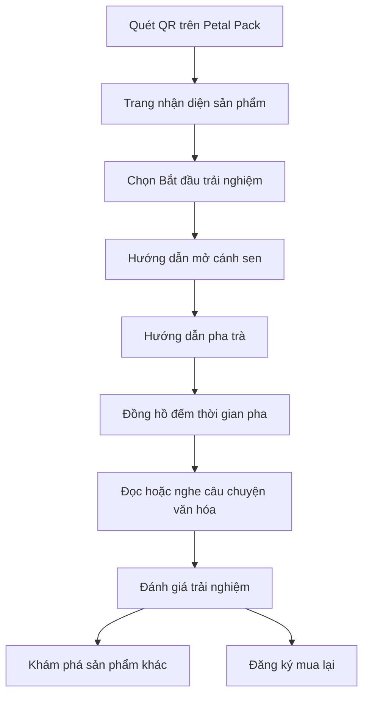

# SENOVA WEB UI IMPLEMENTATION

> Tài liệu khởi tạo triển khai hệ thống giao diện website Senova  
> Phạm vi ưu tiên: Senova Petal Pack và hành trình quét QR  
> Phiên bản: 1.0  
> Ngày cập nhật: 24/06/2026

---

## 1. Mục tiêu hệ thống

Website Senova được triển khai như một **lớp trải nghiệm số kết nối sản phẩm vật lý với nội dung văn hóa**, không chỉ là trang giới thiệu thương hiệu hoặc cửa hàng trực tuyến.

Mỗi Senova Petal Pack có mã QR dẫn người dùng đến một trang trải nghiệm tương ứng. Trang này hỗ trợ người dùng:

1. Nhận diện sản phẩm đang sử dụng.
2. Thực hiện đúng trình tự mở – pha – thưởng thức.
3. Tiếp cận câu chuyện văn hóa liên quan đến sen Việt.
4. Gửi phản hồi sau trải nghiệm.
5. Khám phá hoặc đặt mua lại sản phẩm.

### 1.1. Thông điệp sản phẩm số

> **Mở một cánh sen, pha một câu chuyện Việt.**

### 1.2. Nguyên tắc triển khai

- Mobile-first vì phần lớn lượt truy cập đến từ QR trên bao bì.
- Không bắt buộc đăng nhập ở giai đoạn đầu.
- Nội dung chính phải tải nhanh và đọc được trong 1–3 phút.
- Ưu tiên trải nghiệm văn hóa trước hoạt động bán hàng.
- Mỗi trang chỉ có một hành động chính rõ ràng.
- QR phải dùng đường dẫn động để có thể thay đổi nội dung mà không in lại bao bì.
- Giao diện phải hỗ trợ mở rộng sang Senova Classic và Senova Gift Set.

---

## 2. Phạm vi MVP

### 2.1. Chức năng có trong phiên bản đầu

- Trang chủ giới thiệu Senova.
- Trang giới thiệu Senova Petal Pack.
- Trang trải nghiệm sau khi quét QR.
- Hướng dẫn mở – pha – thưởng thức.
- Thư viện câu chuyện văn hóa.
- Trang chi tiết câu chuyện.
- Biểu mẫu phản hồi nhanh.
- Trang đăng ký đặt trước hoặc mua thử.
- Ghi nhận sự kiện quét QR và hành vi cơ bản.
- Giao diện quản lý nội dung ở mức tối thiểu hoặc dữ liệu nội dung từ MDX/JSON.

### 2.2. Chức năng chưa triển khai trong MVP

- Tài khoản khách hàng.
- Chương trình tích điểm.
- Thanh toán trực tuyến đầy đủ.
- Mã QR duy nhất cho từng đơn vị sản phẩm.
- Blockchain hoặc hệ thống chống giả.
- AI cá nhân hóa nội dung.
- Hệ thống truy xuất nguồn gốc hoàn chỉnh.

---

## 3. Đối tượng sử dụng

### 3.1. Người dùng chính

- Người trẻ tại đô thị, có khả năng chi trả.
- Người quan tâm sản phẩm mang câu chuyện văn hóa Việt.
- Khách mua quà tặng bản địa.
- Người dùng thử tại booth, sự kiện hoặc trường học.

### 3.2. Người dùng quản trị

- Nhóm nội dung Senova.
- Nhóm quản trị sản phẩm.
- Nhóm theo dõi dữ liệu quét QR và phản hồi.

---

## 4. Hành trình người dùng chính



### 4.1. Luồng tối thiểu

```text
Quét QR
→ Nhận diện Petal Pack
→ Xem hướng dẫn pha
→ Tiếp cận câu chuyện văn hóa
→ Gửi phản hồi
→ Mua lại hoặc khám phá thêm
```

### 4.2. Yêu cầu UX

- Người dùng phải thấy tên sản phẩm trong 2 giây đầu.
- Nút “Bắt đầu trải nghiệm” phải xuất hiện ngay vùng đầu trang.
- Không hiển thị popup bán hàng khi người dùng vừa vào trang.
- Không yêu cầu email hoặc số điện thoại trước khi xem nội dung.
- Nút phản hồi chỉ xuất hiện sau khi hoàn thành phần hướng dẫn hoặc câu chuyện.

---

## 5. Kiến trúc thông tin

```text
/
├── /san-pham
│   ├── /petal-pack
│   ├── /classic
│   └── /gift-set
├── /trai-nghiem
│   └── /petal-pack/[storySlug]
├── /van-hoa
│   ├── /bieu-tuong-sen
│   ├── /tra-sen-viet
│   ├── /nghi-thuc-thuong-tra
│   └── /vung-sen-viet
├── /huong-dan-pha
├── /phan-hoi
├── /reorder
├── /gioi-thieu
└── /q/[code]
```

### 5.1. Vai trò của route `/q/[code]`

Route này không hiển thị giao diện độc lập. Nó thực hiện:

1. Nhận mã QR.
2. Ghi nhận sự kiện quét.
3. Xác định sản phẩm, lô và câu chuyện tương ứng.
4. Chuyển hướng đến trang trải nghiệm phù hợp.

Ví dụ:

```text
s.senova.vn/q/PP-2601-A
→ senova.vn/trai-nghiem/petal-pack/mo-canh-sen
```

---

## 6. Danh sách màn hình

| Mã | Màn hình | Mục tiêu chính | Ưu tiên |
|---|---|---|---|
| UI-01 | Trang chủ | Giới thiệu định vị Senova | P1 |
| UI-02 | Trang Petal Pack | Giải thích sản phẩm chủ đạo | P1 |
| UI-03 | Trang QR landing | Bắt đầu trải nghiệm | P0 |
| UI-04 | Hướng dẫn mở và pha | Hỗ trợ sử dụng sản phẩm | P0 |
| UI-05 | Bộ đếm thời gian pha | Hỗ trợ thao tác thực tế | P1 |
| UI-06 | Trang câu chuyện văn hóa | Truyền tải nội dung văn hóa | P0 |
| UI-07 | Biểu mẫu phản hồi | Thu thập dữ liệu người dùng | P0 |
| UI-08 | Trang đặt trước | Tạo chuyển đổi bán hàng | P1 |
| UI-09 | Thư viện văn hóa | Khám phá nội dung khác | P2 |
| UI-10 | Trang Classic | Chuẩn bị mở rộng sản phẩm | P2 |
| UI-11 | Trang Gift Set | Chuẩn bị mở rộng quà tặng | P2 |
| UI-12 | Trang lỗi QR | Xử lý mã không hợp lệ | P0 |

---

## 7. Đặc tả giao diện theo màn hình

## 7.1. UI-03 — Trang QR landing

### Mục tiêu

Xác nhận người dùng đã truy cập đúng sản phẩm và dẫn họ bắt đầu trải nghiệm.

### Cấu trúc

1. Logo Senova/Calmora.
2. Tên sản phẩm: Senova Petal Pack.
3. Tên câu chuyện hoặc chủ đề của pack.
4. Hình ảnh búp sen hoặc sản phẩm.
5. Một đoạn mô tả tối đa 2 câu.
6. Nút chính: **Bắt đầu trải nghiệm**.
7. Nút phụ: **Xem hướng dẫn nhanh**.
8. Mã lô ở cuối trang.

### Tiêu chí chấp nhận

- Hiển thị tốt từ chiều rộng 320 px.
- LCP mục tiêu dưới 2,5 giây trong điều kiện mạng di động phổ biến.
- CTA chính nằm trong vùng nhìn đầu tiên.
- Không có quá 2 CTA cạnh tranh.

---

## 7.2. UI-04 — Hướng dẫn mở – pha – thưởng thức

### Nội dung bốn bước

1. **Mở cánh sen** — mở nhẹ từng lớp cánh.
2. **Đặt túi trà vào cốc** — lấy túi lọc bên trong.
3. **Rót nước và chờ** — hiển thị nhiệt độ và thời gian pha theo công thức đã chốt.
4. **Thưởng thức** — gợi ý cảm nhận hương và vị.

### Thành phần giao diện

- Stepper 4 bước.
- Ảnh hoặc video ngắn theo từng bước.
- Nút “Tiếp tục”.
- Nút quay lại.
- Thanh tiến trình.
- Nút mở bộ đếm thời gian ở bước 3.

### Lưu ý nội dung

Không ghi các thông tin về thời hạn bảo quản, công dụng sức khỏe, nhiệt độ hoặc thời gian pha như một chuẩn tuyệt đối nếu công thức sản phẩm chưa được chốt.

---

## 7.3. UI-05 — Bộ đếm thời gian pha

### Chức năng

- Bắt đầu, tạm dừng và đặt lại thời gian.
- Hiển thị tiến trình trực quan.
- Rung hoặc phát âm thanh khi hoàn tất nếu trình duyệt cho phép.
- Cho phép tắt âm thanh.

### Trạng thái

```text
idle → running → paused → completed
```

---

## 7.4. UI-06 — Trang câu chuyện văn hóa

### Cấu trúc nội dung

1. Tiêu đề câu chuyện.
2. Mô tả ngắn 30–50 từ.
3. Hình ảnh đại diện.
4. Nội dung chính 250–500 từ.
5. Audio 60–120 giây nếu có.
6. Nguồn tham khảo.
7. Người biên soạn hoặc người rà soát.
8. Nút phản hồi.
9. Nút xem câu chuyện tiếp theo.

### Quy tắc biên tập

- Mỗi trang chỉ tập trung vào một chủ đề.
- Không khẳng định các diễn giải biểu tượng như sự thật lịch sử tuyệt đối.
- Ghi nguồn đối với dữ kiện lịch sử, vùng miền hoặc tập quán.
- Phân biệt rõ nội dung văn hóa, nội dung thương hiệu và nội dung quảng bá.

---

## 7.5. UI-07 — Biểu mẫu phản hồi

### Câu hỏi tối thiểu

1. Bạn đánh giá hương vị ở mức nào? — thang 1–5.
2. Bạn đánh giá trải nghiệm mở Petal Pack ở mức nào? — thang 1–5.
3. Nội dung văn hóa có dễ hiểu không? — Có/Không/Một phần.
4. Bạn có cân nhắc mua lại không? — Có/Có thể/Không.
5. Góp ý thêm — không bắt buộc.

### Dữ liệu không bắt buộc

- Email.
- Số điện thoại.
- Họ tên.

Thông tin liên hệ chỉ thu thập khi người dùng chủ động đăng ký mua thử hoặc nhận thông tin.

---

## 7.6. UI-12 — Trang lỗi QR

### Trường hợp xử lý

- Mã không tồn tại.
- Mã đã bị vô hiệu hóa.
- Nội dung đang được cập nhật.
- Không thể kết nối hệ thống.

### Nội dung hiển thị

- Thông báo ngắn, không dùng mã lỗi kỹ thuật.
- Nút quay về trang Petal Pack.
- Nút báo lỗi QR.

---

## 8. Hệ thống thiết kế giao diện

## 8.1. Tính cách thị giác

- Bản địa nhưng không cổ điển hóa quá mức.
- Thanh lịch, cân bằng, có khoảng trắng.
- Ưu tiên hình ảnh thật của trà, cánh sen và sản phẩm.
- Hạn chế họa tiết trang trí dày đặc.
- Tránh dùng hình ảnh không liên quan trực tiếp đến sen Việt hoặc trải nghiệm trà.

## 8.2. Màu nền tảng

Các màu dưới đây được dùng làm token khởi tạo và cần kiểm tra lại độ tương phản trước khi phát hành.

```css
:root {
  --senova-green-900: #2F4638;
  --senova-green-700: #496551;
  --senova-green-100: #E7EEE9;

  --senova-cream-50: #F7F7EB;
  --senova-cream-100: #F1EFE0;

  --senova-gold-600: #AF9558;
  --senova-gold-100: #EFE6CF;

  --senova-petal-500: #C76F98;
  --senova-petal-100: #F4DFE8;

  --text-primary: #1F2A23;
  --text-secondary: #566158;
  --border-default: #D6DCCF;
  --surface-default: #FFFFFF;
  --surface-muted: #F7F7EB;
  --state-error: #9F3A38;
  --state-success: #3D6B4F;
}
```

## 8.3. Typography

### Đề xuất

- Display/Heading: một serif hỗ trợ tiếng Việt tốt.
- Body/UI: một sans-serif dễ đọc trên thiết bị di động.

### Quy tắc

- Tối đa 2 họ font trong toàn hệ thống.
- Body tối thiểu 16 px trên mobile.
- Line-height nội dung dài từ 1.5–1.7.
- Không dùng chữ in hoa toàn bộ cho đoạn dài.
- Không dùng kiểu chữ script cho nội dung chức năng.

## 8.4. Thang khoảng cách

```text
4 / 8 / 12 / 16 / 24 / 32 / 48 / 64 / 96
```

## 8.5. Bo góc

```text
sm: 8px
md: 12px
lg: 20px
pill: 999px
```

## 8.6. Bóng đổ

- Chỉ sử dụng cho card nổi, modal và CTA quan trọng.
- Không sử dụng shadow đậm trên toàn bộ giao diện.

---

## 9. Component inventory

### 9.1. Layout

- `SiteHeader`
- `MobileNavigation`
- `SiteFooter`
- `PageContainer`
- `Section`
- `StoryLayout`
- `ExperienceLayout`

### 9.2. Navigation

- `Breadcrumb`
- `Tabs`
- `Stepper`
- `ProgressBar`
- `BottomActionBar`

### 9.3. Content

- `HeroSection`
- `ProductCard`
- `StoryCard`
- `CulturalFactCard`
- `InstructionStep`
- `MediaBlock`
- `AudioPlayer`
- `SourceReference`

### 9.4. Interaction

- `PrimaryButton`
- `SecondaryButton`
- `IconButton`
- `BrewTimer`
- `RatingScale`
- `FeedbackForm`
- `ShareButton`
- `CopyLinkButton`

### 9.5. Status

- `LoadingSkeleton`
- `EmptyState`
- `ErrorState`
- `OfflineNotice`
- `SuccessMessage`

---

## 10. Kiến trúc frontend đề xuất

### 10.1. Công nghệ

- Next.js với App Router.
- TypeScript.
- Tailwind CSS.
- MDX hoặc JSON cho nội dung MVP.
- React Hook Form + schema validation cho biểu mẫu.
- Analytics thông qua hệ thống bảo vệ quyền riêng tư hoặc sự kiện nội bộ.
- Triển khai trên Vercel hoặc nền tảng CDN tương đương.

### 10.2. Cấu trúc thư mục

```text
src/
├── app/
│   ├── (marketing)/
│   │   ├── page.tsx
│   │   ├── gioi-thieu/
│   │   └── san-pham/
│   ├── trai-nghiem/
│   │   └── petal-pack/
│   │       └── [storySlug]/
│   ├── van-hoa/
│   │   └── [slug]/
│   ├── huong-dan-pha/
│   ├── phan-hoi/
│   ├── reorder/
│   ├── q/
│   │   └── [code]/
│   ├── api/
│   │   ├── feedback/
│   │   ├── qr-scan/
│   │   └── preorder/
│   ├── layout.tsx
│   └── globals.css
├── components/
│   ├── layout/
│   ├── navigation/
│   ├── product/
│   ├── experience/
│   ├── culture/
│   ├── feedback/
│   └── ui/
├── content/
│   ├── stories/
│   ├── products/
│   └── brew-guides/
├── lib/
│   ├── analytics.ts
│   ├── qr.ts
│   ├── content.ts
│   ├── validation.ts
│   └── constants.ts
├── types/
│   ├── product.ts
│   ├── story.ts
│   ├── qr.ts
│   └── feedback.ts
└── public/
    ├── images/
    ├── audio/
    ├── icons/
    └── qr/
```

---

## 11. Kiểu dữ liệu đề xuất

```ts
export type Product = {
  id: string;
  slug: string;
  name: string;
  line: "petal-pack" | "classic" | "gift-set";
  shortDescription: string;
  heroImage: string;
  status: "draft" | "active" | "archived";
};

export type CulturalStory = {
  id: string;
  slug: string;
  title: string;
  excerpt: string;
  body: string;
  coverImage: string;
  audioUrl?: string;
  readingTime: number;
  sources: SourceReference[];
  reviewer?: string;
  status: "draft" | "review" | "published";
};

export type QRCodeRecord = {
  code: string;
  productId: string;
  batchId?: string;
  storySlug: string;
  isActive: boolean;
  redirectPath: string;
};

export type FeedbackPayload = {
  productId: string;
  batchId?: string;
  tasteRating: number;
  openingExperienceRating: number;
  cultureContentClarity: "yes" | "partial" | "no";
  repurchaseIntent: "yes" | "maybe" | "no";
  comment?: string;
  consentToContact?: boolean;
  email?: string;
};
```

---

## 12. Nội dung mẫu cho QR landing

### Tiêu đề

**Senova Petal Pack**

### Mô tả

Mỗi cánh sen mở ra một phần của trải nghiệm. Hãy bắt đầu từ việc mở pack, pha trà và khám phá câu chuyện được gói cùng sản phẩm này.

### CTA chính

**Bắt đầu trải nghiệm**

### CTA phụ

**Xem hướng dẫn nhanh**

---

## 13. Nội dung mẫu cho hướng dẫn trải nghiệm

### Bước 1 — Mở cánh sen

Mở nhẹ từng lớp cánh để quan sát cấu trúc Petal Pack và lấy phần trà bên trong.

### Bước 2 — Chuẩn bị trà

Đặt túi trà vào cốc sạch. Sử dụng lượng nước phù hợp với hướng dẫn của phiên bản sản phẩm.

### Bước 3 — Pha trà

Rót nước và bắt đầu bộ đếm thời gian. Trong lúc chờ, người dùng có thể nghe câu chuyện ngắn về sen.

### Bước 4 — Thưởng thức

Quan sát màu nước, cảm nhận hương và vị trà trước khi xem phần nội dung văn hóa tiếp theo.

---

## 14. Analytics và sự kiện cần ghi nhận

| Event | Ý nghĩa |
|---|---|
| `qr_scan` | Người dùng quét QR |
| `experience_start` | Bắt đầu trải nghiệm |
| `instruction_step_view` | Xem từng bước hướng dẫn |
| `brew_timer_start` | Khởi động bộ đếm |
| `story_view` | Mở câu chuyện văn hóa |
| `story_complete` | Đọc hoặc nghe gần hết câu chuyện |
| `feedback_start` | Bắt đầu gửi phản hồi |
| `feedback_submit` | Hoàn tất phản hồi |
| `preorder_click` | Nhấn đăng ký đặt trước |
| `share_click` | Chia sẻ nội dung |

### 14.1. Chỉ số MVP

- Tỷ lệ quét QR trên số pack đã phát hành.
- Tỷ lệ bắt đầu trải nghiệm sau khi quét.
- Tỷ lệ hoàn thành hướng dẫn.
- Tỷ lệ mở câu chuyện.
- Tỷ lệ gửi phản hồi.
- Tỷ lệ nhấn mua lại hoặc đặt trước.

---

## 15. Accessibility

- Tương phản màu đạt tối thiểu WCAG AA.
- Có `alt` cho toàn bộ ảnh nội dung.
- Nút bấm có vùng chạm tối thiểu 44 × 44 px.
- Không truyền tải thông tin chỉ bằng màu sắc.
- Audio có transcript.
- Video có caption nếu có lời thoại.
- Stepper và timer sử dụng được bằng bàn phím.
- Hỗ trợ `prefers-reduced-motion`.

---

## 16. SEO và chia sẻ mạng xã hội

- Mỗi câu chuyện có title và description riêng.
- Có Open Graph image theo từng nội dung.
- Dùng URL ngắn, không chứa ký tự khó đọc.
- Tạo sitemap cho trang công khai.
- Không index route chuyển hướng `/q/[code]`.
- Dùng structured data phù hợp cho sản phẩm và bài viết khi có đủ dữ liệu.

---

## 17. Hiệu năng

### Mục tiêu

- Tối ưu cho mạng di động.
- Ảnh dùng định dạng WebP/AVIF.
- Không tự động phát video có âm thanh.
- Lazy-load nội dung phía dưới màn hình đầu.
- Audio chỉ tải khi người dùng tương tác.
- JavaScript phía client chỉ dùng cho thành phần thực sự cần tương tác.

### Ngân sách trang QR landing

```text
HTML + CSS + JS ban đầu: ưu tiên dưới 250 KB nén
Hero image: ưu tiên dưới 200 KB
Không quá 2 font weight tải ở màn hình đầu
```

---

## 18. Bảo mật và quyền riêng tư

- Không lưu dữ liệu cá nhân khi chưa có sự đồng ý.
- Biểu mẫu phải có validation phía client và server.
- Có rate-limit cho API phản hồi và đặt trước.
- Không đưa mã bí mật vào frontend.
- Không hiển thị trực tiếp dữ liệu lô nội bộ nhạy cảm.
- Có chính sách quyền riêng tư ngắn, dễ hiểu.

---

## 19. Kế hoạch triển khai

## Sprint 0 — Khởi tạo

- Chốt stack kỹ thuật.
- Tạo repository và quy ước branch.
- Thiết lập Next.js, TypeScript, Tailwind CSS.
- Khởi tạo token màu, typography và spacing.
- Tạo layout gốc và cấu trúc route.
- Chuẩn bị nội dung mẫu và asset.

## Sprint 1 — QR experience core

- Xây dựng QR landing.
- Xây dựng stepper hướng dẫn.
- Xây dựng brew timer.
- Xây dựng trang câu chuyện.
- Xử lý responsive mobile.

## Sprint 2 — Feedback và conversion

- Xây dựng form phản hồi.
- Xây dựng trang đặt trước.
- Ghi nhận analytics event.
- Xây dựng trạng thái thành công và lỗi.

## Sprint 3 — Marketing pages

- Trang chủ.
- Trang Petal Pack.
- Trang giới thiệu thương hiệu.
- Thư viện văn hóa.

## Sprint 4 — QA và phát hành thử

- Kiểm thử trên thiết bị thật.
- Kiểm thử tốc độ mạng thấp.
- Kiểm thử QR theo lô.
- Kiểm thử accessibility.
- Sửa lỗi nội dung và giao diện.
- Phát hành bản pilot.

---

## 20. Backlog khởi tạo

### P0 — Bắt buộc

- [ ] Tạo app shell.
- [ ] Thiết lập design tokens.
- [ ] Tạo route `/q/[code]`.
- [ ] Tạo QR landing page.
- [ ] Tạo component `Stepper`.
- [ ] Tạo component `BrewTimer`.
- [ ] Tạo trang câu chuyện.
- [ ] Tạo biểu mẫu phản hồi.
- [ ] Tạo error state cho QR không hợp lệ.
- [ ] Ghi nhận `qr_scan` và `feedback_submit`.

### P1 — Nên có

- [ ] Trang chủ.
- [ ] Trang Petal Pack.
- [ ] Trang đặt trước.
- [ ] Audio player.
- [ ] Chia sẻ câu chuyện.
- [ ] Analytics dashboard cơ bản.

### P2 — Mở rộng

- [ ] Thư viện văn hóa.
- [ ] Trang Classic.
- [ ] Trang Gift Set.
- [ ] Song ngữ Việt–Anh.
- [ ] Nội dung theo mùa hoặc sự kiện.
- [ ] QR cá nhân hóa cho Gift Set.

---

## 21. Definition of Done

Một giao diện được xem là hoàn tất khi:

- Đúng nội dung và route đã chốt.
- Responsive từ 320 px đến desktop.
- Không có lỗi TypeScript hoặc lint.
- Có loading, empty và error state.
- Có kiểm thử hành vi chính.
- Đạt kiểm tra accessibility cơ bản.
- Không chứa dữ liệu giả gây hiểu nhầm.
- Sự kiện analytics được ghi nhận đúng.
- Được kiểm thử bằng QR thật trên ít nhất hai thiết bị di động.

---

## 22. Tiêu chí nghiệm thu MVP

1. Người dùng quét QR và truy cập đúng câu chuyện theo mã.
2. Trang đầu tải nhanh và hiển thị đúng trên điện thoại.
3. Người dùng hoàn thành được hành trình mở – pha – thưởng thức.
4. Bộ đếm thời gian hoạt động ổn định.
5. Nội dung văn hóa có nguồn và trạng thái duyệt.
6. Phản hồi được gửi thành công mà không bắt buộc đăng nhập.
7. Hệ thống ghi nhận được lượt quét và lượt gửi phản hồi.
8. QR lỗi được xử lý bằng giao diện thân thiện.
9. Website có thể thay nội dung đích mà không thay mã QR đã in.
10. Cấu trúc frontend có thể mở rộng sang Classic và Gift Set.

---

## 23. Quyết định kỹ thuật cần chốt trước khi code

- Tên miền chính thức và tên miền rút gọn cho QR.
- Công thức pha chính thức cho Petal Pack.
- Danh sách 3–5 câu chuyện dùng trong pilot.
- Bộ ảnh sản phẩm thật hoặc mockup được phép sử dụng.
- Hệ thống lưu dữ liệu phản hồi.
- Công cụ analytics.
- Cơ chế quản trị ánh xạ QR.
- Người chịu trách nhiệm duyệt nội dung văn hóa.

---

## 24. Kết quả đầu ra của giai đoạn đầu

Sau giai đoạn triển khai MVP, hệ thống cần tạo được chuỗi trải nghiệm hoàn chỉnh:

```text
Cánh sen vật lý
→ QR động
→ Hướng dẫn pha
→ Câu chuyện văn hóa
→ Phản hồi người dùng
→ Đăng ký mua lại
```

Đây là nền tảng để Senova kiểm chứng đồng thời ba giả định:

1. Người dùng có quét QR khi được cung cấp lý do đủ rõ.
2. Nội dung văn hóa làm tăng giá trị cảm nhận của Petal Pack.
3. Trải nghiệm số có thể tạo phản hồi và ý định mua lại.

---

# PHỤ LỤC A: HƯỚNG DẪN NHẬN DIỆN THƯƠNG HIỆU & HÌNH ẢNH (BRANDING DESIGN GUIDE)

## A.1. Triết lý thiết kế (Design Philosophy)
Website Senova không phải là một cửa hàng trực tuyến (E-commerce) thông thường. Nó là một **Không gian kể chuyện (Storytelling Space)**.
* **Mục tiêu:** Chuyển hóa hành trình "Mở – Pha – Thưởng thức – Trao tặng" thành trải nghiệm cuộn (scroll) trên màn hình.
* **Quy tắc cốt lõi:**
  * **Lá non, sen trầm, nền tối:** Sắc độ giữ chất tĩnh và ấm, làm nổi bật sản phẩm và khối 3D.
  * **Khoảng thở lớn, chữ gọn:** Tối đa hóa khoảng trắng (negative space), không nhồi nhét thông tin.
  * **Tinh tế, chậm, rõ:** Không sử dụng các nút CTA hối thúc kiểu "Mua ngay", "Giảm giá". Thay vào đó là "Khám phá nghi thức", "Liên hệ thử nghiệm", "Đọc câu chuyện".

## A.2. Hệ thống màu sắc & Kiểu chữ (Theme Spec)
* **Bảng màu chủ đạo (Theme Palette):**
  * **Nền trang (Background):** `#07110F` (Đen xanh rêu sâu thẳm) - Tạo cảm giác tĩnh mịch của hồ sen đêm.
  * **Văn bản chính (Primary Text):** `#FFFAF0` (Trắng ngà/Ngọc trai) - Đọc dịu mắt hơn trắng tinh.
  * **Điểm nhấn 1 (Senova Gold):** `#F8DF93` - Màu vàng của nhụy sen, dùng cho các viền, thẻ nhãn (eyebrow) và icon.
  * **Điểm nhấn 2 (Lotus Pink):** `#B95672` - Sắc hồng trầm của cánh sen sấy khô (Petal Pack). Không dùng hồng tươi.
  * **Viền & Khối (Surface):** `rgba(255, 250, 240, 0.06)` - Sử dụng hiệu ứng kính mờ (Glassmorphism) để tạo chiều sâu.
* **Typography:**
  * **Tiêu đề (Headings):** Phông chữ có chân (Serif) mang tính di sản: *Playfair Display*, *Lora*, hoặc *Iowan Old Style*.
  * **Văn bản (Body):** Phông chữ không chân (Sans-serif) thanh mảnh: *Inter*, *Helvetica Neue*, hoặc *Be Vietnam Pro*.

## A.3. Chiến lược Hình ảnh (Visual Strategy)
* **Senova Petal Pack (Dòng chủ đạo):** Góc chụp cận cảnh (Macro) vào bề mặt cánh sen sấy. Ánh sáng Chiaroscuro (Tối - Sáng tương phản mạnh) chiếu xiên để tạo độ nổi khối. Sắp đặt tĩnh (búp sen hé mở nửa chừng cạnh tách trà bốc khói mỏng).
* **Senova Classic (Dòng hằng ngày):** Góc 45 độ từ trên xuống (Flatlay nhẹ) hoặc góc ngang mắt. Ánh sáng sáng sủa hơn, ánh sáng ban mai lọt qua rèm (Dappled light) tạo bóng đổ tự nhiên.
* **Senova Gift Set (Dòng quà tặng):** Toàn cảnh (Wide) thấy sự bề thế của hộp gỗ/hộp bồi, sau đó là các góc đặc tả (Close-up) logo ép kim, thẻ câu chuyện. Ánh sáng sang trọng, mượt mà (Soft lighting) trên nền xanh rêu hoặc mặt bàn gỗ óc chó.

---

# PHỤ LỤC B: THIẾT KẾ SÂN KHẤU TRƯNG BÀY SẢN PHẨM (SENOVA PRODUCT THEATRE)

Trang sản phẩm (`/products`) được thiết kế như một **showroom số có phối cảnh**, giúp phân biệt rõ 3 dòng sản phẩm theo một hành trình có chủ đích: *Uống hằng ngày (Classic) -> Trải nghiệm nghi thức (Petal Pack) -> Trao tặng văn hóa (Gift Set)*.

## B.1. Nguyên tắc thị giác trang sản phẩm
* Không dùng grid ba cột làm bố cục chính. Không dùng ba card đồng cấp.
* Petal Pack giữ vị trí trung tâm, chiếm 45-55% tỷ trọng thị giác.
* Chuyển động phải giúp giải thích sản phẩm, không chỉ để trang trí. Timing chậm rãi (0.8s - 1.2s).

## B.2. Cấu trúc các Section sản phẩm
* **Section 1: Hero phối cảnh ba lớp:** Parallax tối đa `2-3deg`. Lớp sau là Gift Set (trang trọng), lùi trái thấp hơn là Classic (hằng ngày), tiền cảnh trung tâm là Petal Pack (nghi thức).
* **Section 2: Lotus Orbit Selector:** Ba sản phẩm nằm trên một quỹ đạo lấy cảm hứng từ đường cong cánh sen. Khi chọn một dòng, quỹ đạo xoay nhẹ và đưa sản phẩm đó lại gần người xem.
* **Section 3: Nghi thức mở cánh (Petal Pack):** Cuộn cố định (Sticky) qua 4 trạng thái: *01 / Mở búp sen -> 02 / Chạm chất liệu thật -> 03 / Pha trà định lượng -> 04 / Thưởng thức chậm*.
* **Section 4: Classic (Nhịp trà hằng ngày):** Bố cục mặt bàn góc chếch, các gói trà chạy theo đường cong mềm đến tách trà. Không dùng card.
* **Section 5: Gift Set (Món quà mở ra):** Trạng thái đóng nghiêng `8-12deg`, nền tối viền vàng mảnh. Trạng thái mở nắp sẽ tách hộp ra thành từng lớp thành phần (Trà, Petal Pack, hướng dẫn pha, thẻ câu chuyện) kèm chú thích.
* **Section 6: Kết:** Đường trải nghiệm cong hợp lại thành biểu tượng sen Calmora.

