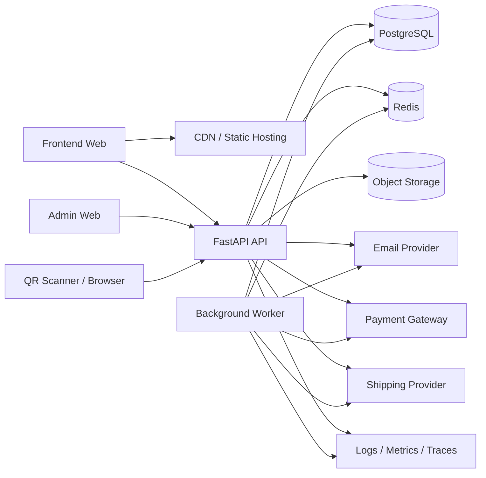
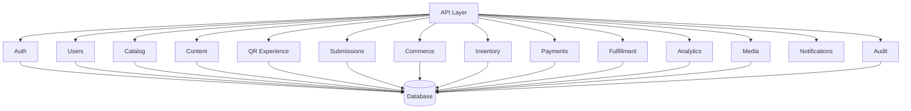
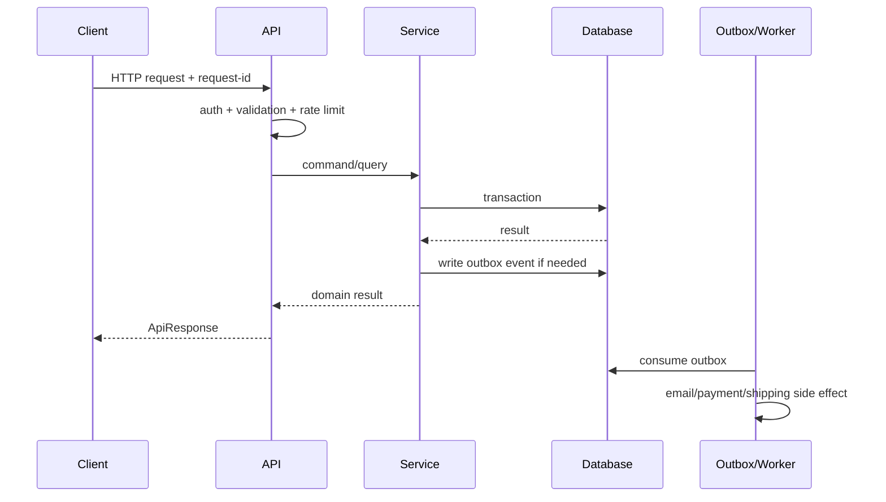

# 01. System Scope and Architecture

## 1. Trạng thái tài liệu

- Phạm vi: `CURRENT` + `NEXT` + `TARGET`.
- Kiến trúc mục tiêu: modular monolith.
- Runtime chính: FastAPI.
- Database mục tiêu: PostgreSQL.
- Cache/rate limit/job broker: Redis khi cần.
- Object storage: S3-compatible storage hoặc dịch vụ tương đương.

## 2. Mục tiêu kiến trúc

Backend Senova phải hỗ trợ đồng thời bốn nhóm nhu cầu:

1. **Truyền tải nội dung và văn hóa**: sản phẩm, câu chuyện, journal, chính sách, SEO và QR experience.
2. **Thu thập và xử lý nhu cầu khách hàng**: contact, partner, sample-interest, feedback, reorder/pre-order.
3. **Thương mại**: catalog, collection, cart, wishlist, order, payment, shipment và hoàn tiền khi dự án chuyển sang bán hàng thật.
4. **Vận hành nội bộ**: quản trị nội dung, sản phẩm, QR, lead, đơn hàng, tồn kho, analytics và audit.

Kiến trúc phải ưu tiên:

- Dễ phát triển với nhóm nhỏ.
- Phân tách domain rõ.
- Dễ kiểm thử.
- Dễ chuyển từng phần từ seed/mock sang database thật.
- Không tạo chi phí vận hành microservice khi quy mô chưa cần.
- Có đường nâng cấp khi lưu lượng, đội ngũ hoặc yêu cầu tích hợp tăng.

## 3. Phạm vi hệ thống

### 3.1. Trong phạm vi

#### Public API

- Health/readiness.
- Product catalog và detail.
- Collection và search.
- Public content, journal, service, policy và SEO metadata.
- QR resolve, QR experience, batch override và scan tracking.
- Submission và consent.
- Analytics event không chứa PII.
- Media public URL.

#### Account API

- Authentication.
- Profile.
- Address.
- Wishlist.
- Cart.
- Order history.
- Order status.
- Privacy request.

#### Admin API

- Catalog management.
- Content management.
- QR management.
- Submission/lead management.
- Order and fulfillment management.
- Inventory.
- Customer support view.
- Analytics/reporting.
- Media library.
- Roles and permissions.
- Audit log.

#### Integrations

- Email provider.
- Object storage/CDN.
- Payment gateway khi chuyển sang transactional mode.
- Shipping provider khi cần.
- Analytics/BI export.

### 3.2. Ngoài phạm vi mặc định

Các mục sau chỉ triển khai khi có yêu cầu và dữ liệu kiểm chứng:

- Blockchain/NFT.
- Chống hàng giả cấp từng đơn vị bằng cryptographic identity.
- Recommendation AI thời gian thực.
- Microservice độc lập cho từng domain.
- Data warehouse riêng.
- Marketplace nhiều nhà bán.
- Multi-tenant SaaS.

## 4. Bối cảnh code hiện tại

### 4.1. `CURRENT`

Backend hiện đang:

- Dùng một `FastAPI` app trong `app/main.py`.
- Đọc seed JSON cho catalog, QR và QR experience.
- Cung cấp API health, catalog, QR, submission và analytics.
- Lưu submission và analytics event bền vững trong PostgreSQL; rate-limit bucket vẫn ở memory.
- Hỗ trợ idempotency cho submission và không trả payload chứa PII qua status lookup công khai.
- Có contract test cho các luồng public chính.
- Chưa có ORM/migration có version; schema hiện được bootstrap idempotently khi khởi động.
- Chưa có authentication/RBAC.
- Chưa có catalog quản trị bằng database/CMS, giá và tồn kho động.
- Chưa có commerce thật.

### 4.2. Rủi ro của trạng thái hiện tại

- Rate limit in-memory không nhất quán giữa instance/worker.
- Schema chưa có migration versioning cho các thay đổi production về sau.
- Không có transaction.
- Không có audit trail.
- Không có migration versioning.
- Không có cơ chế backup/restore.
- Không phù hợp để xử lý order/payment production.

## 5. Kiến trúc logic mục tiêu



## 6. Kiến trúc module



### 6.1. Auth

Trách nhiệm:

- Register/login/logout.
- Email verification.
- Password reset.
- Session/refresh token.
- Authentication dependency.

Không chịu trách nhiệm:

- Quản lý profile chi tiết.
- Business permission của từng module.

### 6.2. Users

Trách nhiệm:

- Profile.
- Address.
- Consent.
- Account status.
- Privacy request.

### 6.3. Catalog

Trách nhiệm:

- Product.
- Variant/SKU.
- Price.
- Collection.
- Product media.
- Public availability.
- Search indexing metadata.

### 6.4. Content

Trách nhiệm:

- Static pages.
- Journal.
- Service/policy page.
- SEO metadata.
- Content revision và publish workflow.

### 6.5. QR Experience

Trách nhiệm:

- QR registry.
- QR status.
- Safe redirect.
- Experience content version.
- Batch override.
- Scan tracking.

### 6.6. Submissions

Trách nhiệm:

- Contact.
- Partner inquiry.
- Sample-interest.
- Feedback.
- Reorder/pre-order inquiry.
- Lead status, assignment, note và follow-up.

### 6.7. Commerce

Trách nhiệm:

- Wishlist.
- Cart.
- Checkout orchestration.
- Order.
- Order item snapshot.
- Order status history.
- Cancellation request.

### 6.8. Inventory

Trách nhiệm:

- Stock level.
- Reservation.
- Stock movement.
- Batch/lot reference khi cần.

### 6.9. Payments

Trách nhiệm:

- Payment intent/reference.
- Webhook verification.
- Payment status.
- Refund.
- Reconciliation metadata.

Không lưu:

- Card number.
- CVV.
- Full payment credential.

### 6.10. Fulfillment

Trách nhiệm:

- Shipment.
- Tracking.
- Delivery status.
- Shipping provider integration.

### 6.11. Analytics

Trách nhiệm:

- Event ingestion.
- Aggregate metrics.
- Export/report.
- Không nhận PII trong event public.

### 6.12. Media

Trách nhiệm:

- Upload intent/presigned URL.
- Metadata.
- Alt text.
- Ownership/reference.
- Soft delete.

### 6.13. Notifications

Trách nhiệm:

- Email template.
- Notification job.
- Retry.
- Delivery status.

### 6.14. Audit

Trách nhiệm:

- Ghi lại thay đổi admin quan trọng.
- Actor, action, target, before/after summary.
- Correlation ID.

## 7. Layering

Mỗi request đi qua các lớp:

```text
HTTP Route
  -> Authentication/Authorization Dependency
  -> Request Schema Validation
  -> Application Service
  -> Repository/Integration Adapter
  -> Database or External Service
  -> Response Schema
```

Quy tắc:

- Route không chứa business logic dài.
- Service không phụ thuộc trực tiếp vào `Request` của FastAPI.
- Repository không quyết định business state.
- Pydantic schema không thay thế database constraint.
- External provider phải nằm sau adapter/interface.

## 8. Luồng request chuẩn



## 9. Đồng bộ và bất đồng bộ

### Đồng bộ

Dùng cho:

- Resolve QR.
- Đọc catalog/content.
- Login.
- Tạo submission.
- Tạo order draft.
- Cập nhật admin cần phản hồi ngay.

### Bất đồng bộ

Dùng cho:

- Gửi email.
- Generate thumbnail.
- Export CSV lớn.
- Đồng bộ shipping.
- Retry webhook outbound.
- Aggregate analytics.
- Cleanup/retention.

Không đưa tác vụ chậm vào request path nếu không cần thiết.

## 10. Database và transaction boundary

Một service method thay đổi nhiều bảng liên quan phải dùng cùng transaction, ví dụ:

- Tạo order + order items + status history + inventory reservation.
- Capture payment + cập nhật order payment state + ghi outbox event.
- Publish content + tạo revision + audit log.

Không gọi external provider trong khi giữ database transaction mở lâu. Mẫu ưu tiên:

1. Ghi local state và outbox.
2. Commit.
3. Worker thực hiện side effect.
4. Cập nhật kết quả idempotently.

## 11. API surface

Base URL:

```text
/api/v1
```

Khuyến nghị chuyển từ `/api` sang `/api/v1` khi bắt đầu API production. Để không phá frontend hiện tại:

- Giữ alias `/api` trong giai đoạn chuyển tiếp; hoặc
- Cấu hình frontend dùng `/api/v1` cùng một lần release.

Nhóm route:

```text
/api/v1/public/*
/api/v1/auth/*
/api/v1/me/*
/api/v1/admin/*
/api/v1/webhooks/*
```

Một số route public có thể giữ ngắn để tương thích:

```text
/api/v1/products
/api/v1/qr/{code}
/api/v1/submissions
/api/v1/analytics/events
```

## 12. Caching

Cache phù hợp:

- Product list public.
- Product detail public.
- Collection.
- Published content.
- QR experience content đã publish.

Không cache hoặc phải cache cẩn trọng:

- User profile.
- Cart.
- Order.
- Payment.
- Inventory availability chính xác.
- Submission admin view.

Cache key phải có:

- Resource ID/slug.
- Locale.
- Version nếu có.
- Visibility/publish state nếu khác nhau.

## 13. Search

Giai đoạn đầu:

- PostgreSQL full-text search hoặc `ILIKE` có index phù hợp.

Chỉ bổ sung search engine riêng khi:

- Số lượng sản phẩm/content tăng đáng kể.
- Cần typo tolerance, ranking phức tạp hoặc faceting lớn.

## 14. File/media architecture

Luồng upload ưu tiên:

1. Admin yêu cầu upload intent.
2. Backend kiểm tra quyền, loại file, kích thước.
3. Backend trả presigned URL.
4. Client upload trực tiếp object storage.
5. Client gọi complete endpoint.
6. Worker scan/resize/metadata extraction nếu cần.
7. Media asset chuyển `processing -> ready`.

Không lưu binary lớn trong PostgreSQL.

## 15. Tính sẵn sàng và scale

### Giai đoạn nhỏ

- 1 API instance.
- PostgreSQL managed.
- Redis optional.
- Background job có thể chạy chung service riêng process.

### Giai đoạn tăng trưởng

- Nhiều API replica stateless.
- Redis dùng chung cho rate limit/cache/job.
- Worker riêng.
- CDN cho media.
- Read replica chỉ khi thực sự cần.

Điều kiện để chạy nhiều instance:

- Không còn business state trong memory.
- Session/rate limit dùng shared store.
- File không ghi local disk tạm thời lâu dài.
- Job có distributed lock/idempotency.

## 16. Quyết định kiến trúc chính

| Quyết định | Lựa chọn | Lý do |
| --- | --- | --- |
| Kiểu hệ thống | Modular monolith | Phù hợp đội nhỏ, vẫn giữ ranh giới domain. |
| API | REST + OpenAPI | FastAPI hỗ trợ tốt, frontend dễ tích hợp. |
| Database | PostgreSQL | Transaction, JSONB, index và hệ sinh thái tốt. |
| ORM | SQLAlchemy 2.x | Tương thích FastAPI, explicit transaction. |
| Migration | Alembic | Version schema. |
| Cache/job | Redis | Chỉ thêm khi cần shared state/background jobs. |
| Media | Object storage | Không làm phình database hoặc ổ đĩa chạy ứng dụng. |
| Auth | Cookie session hoặc access+refresh token an toàn | Tùy mô hình deploy; phải tránh token lưu không an toàn. |
| Payment | Provider token/reference | Giảm phạm vi dữ liệu nhạy cảm. |
| Async side effect | Outbox + worker | Tránh mất email/event sau commit. |

## 17. Anti-pattern cần tránh

- Tiếp tục mở rộng toàn bộ backend trong một `main.py`.
- Dùng `dict`/`list` global làm database production.
- Trộn schema frontend với ORM model.
- Cho admin route chỉ dựa vào việc ẩn UI.
- Lưu access token dài hạn trong `localStorage` mà không đánh giá XSS.
- Gọi payment/email provider trực tiếp trong transaction dài.
- Dùng wildcard CORS ở production.
- Ghi raw request body vào log.
- Xóa cứng order, payment, audit hoặc QR đã phát hành.
- Để frontend tự quyết định giá cuối cùng của order.

## 18. Tiêu chí hoàn thành kiến trúc nền

- [ ] App factory/config tách khỏi route.
- [ ] Router tách public/account/admin.
- [ ] PostgreSQL + SQLAlchemy + Alembic.
- [ ] Error envelope thống nhất.
- [ ] Request ID/correlation ID.
- [ ] Structured logging.
- [ ] Auth dependency và permission dependency.
- [ ] Repository/service pattern tối thiểu cho module động.
- [ ] Redis abstraction cho rate limit/cache nếu deploy nhiều instance.
- [ ] Background worker và outbox cho side effect quan trọng.
- [ ] Test database và integration test chạy trong CI.
