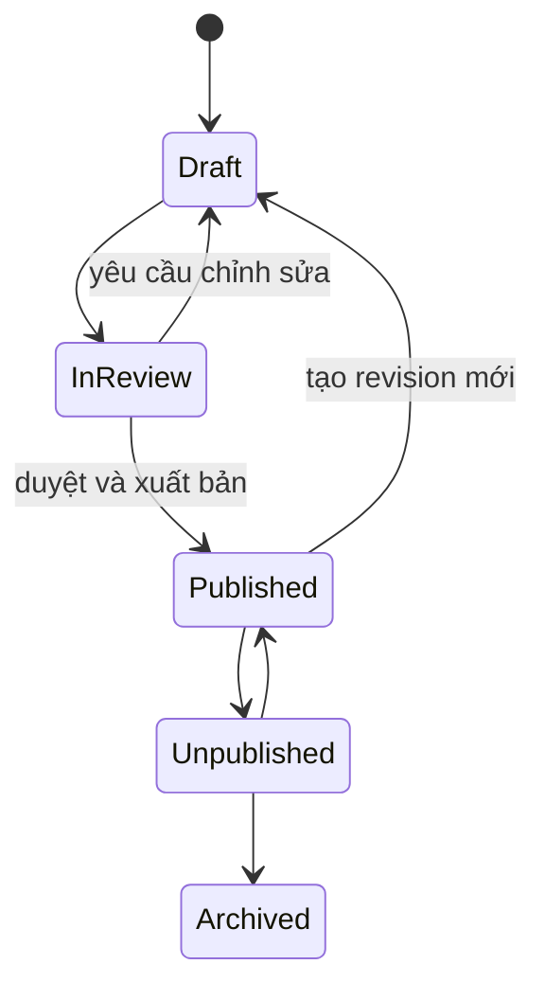
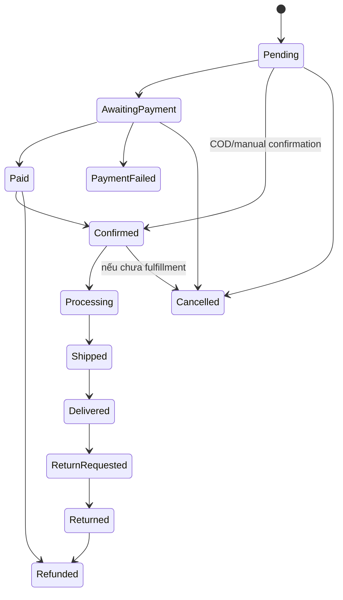

# 02. Domain Model and Business Rules

## 1. Trạng thái tài liệu

- Phạm vi: `CURRENT` + `NEXT` + `TARGET`.
- Mục tiêu: định nghĩa ngôn ngữ nghiệp vụ thống nhất cho frontend, backend, QA và vận hành.
- Nguyên tắc: business rule phải nằm ở application/domain service và được bảo vệ thêm bằng database constraint khi phù hợp.

## 2. Bounded context

Backend Senova được chia thành các miền nghiệp vụ sau:

| Domain | Trách nhiệm chính | Trạng thái |
| --- | --- | --- |
| Catalog | Sản phẩm, biến thể, giá, collection, khả dụng công khai | `NEXT` |
| Content | Trang nội dung, journal, chính sách, SEO, phiên bản xuất bản | `TARGET` |
| QR Experience | Registry QR, trạng thái, nội dung trải nghiệm, lô, scan | `CURRENT` → `NEXT` |
| Submissions | Contact, partner, sample-interest, feedback, pre-order/reorder | `CURRENT` → `NEXT` |
| Identity | Tài khoản, phiên đăng nhập, xác minh email, reset mật khẩu | `TARGET` |
| Customer | Hồ sơ, địa chỉ, consent, privacy request | `TARGET` |
| Commerce | Wishlist, cart, checkout, order, hủy đơn | `TARGET` |
| Inventory | Tồn kho, giữ chỗ, movement, batch/lot | `TARGET` |
| Payment | Payment intent, webhook, capture, refund, reconciliation | `OPTIONAL/TARGET` |
| Fulfillment | Shipment, tracking, giao hàng, hoàn hàng | `OPTIONAL/TARGET` |
| Analytics | Event ingestion, aggregate, export | `CURRENT` → `NEXT` |
| Media | File metadata, upload intent, alt text, reference | `TARGET` |
| Administration | RBAC, audit, back-office workflow | `TARGET` |

## 3. Thuật ngữ chuẩn

| Thuật ngữ | Định nghĩa |
| --- | --- |
| Product | Dòng sản phẩm thương mại hoặc trình bày, ví dụ `classic`, `petal-pack`, `gift-set`. |
| Variant | Phiên bản bán cụ thể của product, có SKU, quy cách và giá riêng. |
| SKU | Mã đơn vị lưu kho của variant. Không đồng nhất với QR code. |
| Batch/Lot | Lô sản xuất hoặc lô thử nghiệm, dùng cho truy vết vận hành và nội dung hướng dẫn theo lô. |
| QR Record | Bản ghi mã QR được phát hành, ánh xạ đến product, batch, content version và destination nội bộ. |
| Experience Content | Nội dung câu chuyện, văn hóa và hướng dẫn sử dụng được version hóa. |
| Submission | Một yêu cầu/đăng ký/phản hồi do khách gửi qua form. |
| Lead | Submission đã được đội vận hành tiếp nhận và theo dõi. |
| Inquiry Mode | Checkout chỉ tạo yêu cầu tư vấn/đặt trước, chưa tạo giao dịch thanh toán thật. |
| Transactional Mode | Checkout tạo order, payment và fulfillment thật. |
| Order Snapshot | Bản sao tên, SKU, đơn giá, thuế/giảm giá tại thời điểm đặt hàng, không phụ thuộc giá hiện tại. |
| Consent | Bản ghi đồng ý theo mục đích cụ thể, có thời điểm và nguồn. |
| Audit Log | Nhật ký bất biến về hành động quản trị quan trọng. |

## 4. Catalog domain

### 4.1. Product

Thuộc tính tối thiểu:

- `id`
- `slug`
- `name`
- `line`
- `status`
- `short_description`
- `description`
- `tagline`
- `role`
- `primary_media_id`
- `seo_metadata`
- `published_at`
- `created_at`, `updated_at`

Trạng thái đề xuất:

```text
draft -> active -> archived
   \------> archived
```

Business rules:

1. `slug` là duy nhất, chữ thường, dùng dấu gạch ngang và không tái sử dụng ngay sau khi archive.
2. Product `draft` không xuất hiện ở public API, trừ khi có cơ chế preview có xác thực.
3. Product `active` phải có tối thiểu tên, slug, mô tả ngắn, ảnh đại diện và SEO title.
4. Archive không xóa order item, QR record hoặc analytics lịch sử.
5. Ba slug hiện tại là `classic`, `petal-pack`, `gift-set`; không hard-code lâu dài trong business logic.

### 4.2. Variant

Thuộc tính:

- `id`, `product_id`
- `sku`
- `name`
- `status`
- `attributes_json`
- `weight`, `dimensions`
- `price_amount`, `currency`
- `compare_at_price_amount`
- `is_default`

Business rules:

1. `sku` duy nhất toàn hệ thống.
2. Mỗi product active có đúng một default variant nếu product có bán.
3. Giá dùng số nguyên nhỏ nhất của tiền tệ; với VND lưu số nguyên đồng.
4. Giá âm bị cấm; `compare_at_price` nếu có phải lớn hơn hoặc bằng giá bán.
5. Không xóa variant đã xuất hiện trong order; chỉ chuyển `archived`.

### 4.3. Collection

Business rules:

- Slug duy nhất.
- Có thứ tự hiển thị.
- Một product có thể thuộc nhiều collection.
- Collection công khai chỉ chứa product đủ điều kiện hiển thị.

## 5. Content domain

### 5.1. Content item

Các loại nội dung:

- Trang thương hiệu/dự án.
- Câu chuyện sản phẩm.
- Journal/article.
- Dịch vụ.
- Chính sách.
- FAQ.
- SEO landing page.

Trạng thái:



Business rules:

1. Nội dung public chỉ lấy revision `published` có hiệu lực.
2. Không sửa trực tiếp revision đã publish; tạo revision mới.
3. Nội dung văn hóa và hướng dẫn pha phải có nguồn/ghi chú nội bộ khi cần kiểm chứng.
4. Không tự suy diễn nội dung hướng dẫn dựa trên tên sản phẩm hoặc batch.
5. Mỗi locale có revision riêng; fallback locale phải được cấu hình rõ.

## 6. QR Experience domain

### 6.1. QR Record

Trạng thái:

- `active`
- `paused`
- `expired`
- `revoked`

Business rules bắt buộc:

1. `code` được chuẩn hóa bằng `strip().upper()` và duy nhất.
2. `destination` chỉ được chọn từ path nội bộ cho phép, hiện ưu tiên `/experience/*`.
3. Không chấp nhận destination từ query string của client.
4. QR tồn tại nhưng inactive trả trạng thái nghiệp vụ để frontend hiển thị; không giả thành `404`.
5. `expired` có thể là trạng thái lưu hoặc suy ra từ `expires_at`.
6. `revoked` không bị xóa để giữ lịch sử và thông báo phù hợp.
7. QR không được quảng bá là cơ chế chống hàng giả nếu chưa có mã unique từng đơn vị và quy trình xác thực.
8. Scan tracking không được block redirect; lỗi analytics không làm hỏng trải nghiệm chính.

### 6.2. Experience content

Khóa logic:

```text
(product_slug, content_version, locale)
```

Batch override:

```text
(batch_code, product_slug, content_version)
```

Business rules:

- Override chỉ thay các trường cho phép, ví dụ `guidance` và `notice`.
- Override không được thay đổi product identity hoặc destination.
- Nội dung chưa publish không được trả public.
- `content_version` của QR phải tham chiếu nội dung tồn tại trước khi QR được active.

## 7. Submission and lead domain

### 7.1. Submission kind

Hiện hỗ trợ:

- `feedback`
- `pre-order`
- `sample-interest`
- `contact`
- `partners`

Trạng thái đề xuất:

```text
new -> in_review -> contacted -> qualified -> converted
  \-> spam
  \-> archived
  \-> rejected
```

Business rules:

1. Payload được validate theo `kind`.
2. Honeypot `website` có giá trị phải bị từ chối với `SPAM_DETECTED`.
3. Text được trim và loại ký tự nguy hiểm tối thiểu; output vẫn phải escape ở frontend.
4. Không log raw payload chứa PII ở production.
5. Tạo submission thành công không đồng nghĩa với đã chấp nhận đơn hàng hoặc cam kết cung ứng.
6. `pre-order` ở Inquiry Mode chỉ tạo lead; không trừ tồn kho, không tạo payment.
7. Chuyển trạng thái lead phải lưu actor, thời điểm và ghi chú nếu thay đổi quan trọng.
8. Không cho phép public đọc submission theo ID trong production nếu không có token/authorization phù hợp.

### 7.2. Consent

Consent phải tách khỏi checkbox chung khi đưa vào production:

- `purpose`: marketing, follow-up, research, privacy terms.
- `status`: granted, withdrawn.
- `policy_version`.
- `source`.
- `granted_at`, `withdrawn_at`.

Business rules:

- Không suy diễn marketing consent từ việc gửi contact/feedback.
- Rút consent không xóa dữ liệu cần giữ theo nghĩa vụ vận hành/pháp lý, nhưng chặn xử lý theo mục đích đã rút.

## 8. Identity and customer domain

### 8.1. User account

Trạng thái:

- `pending_verification`
- `active`
- `locked`
- `disabled`
- `deleted`

Business rules:

1. Email được normalize và unique theo quy tắc đã chọn.
2. Password chỉ lưu hash mạnh; không log, không gửi lại qua email.
3. Token xác minh/reset là single-use, có hạn và chỉ lưu hash nếu có thể.
4. Khóa tài khoản không xóa order hoặc audit history.
5. Xóa tài khoản là quy trình privacy có kiểm tra ràng buộc, không phải `DELETE` vật lý ngay.

### 8.2. Address

- Một user có nhiều địa chỉ.
- Có tối đa một địa chỉ mặc định cho mỗi loại hoặc dùng một default chung.
- Order phải snapshot địa chỉ giao hàng; sửa address book không đổi order cũ.

## 9. Commerce domain

### 9.1. Hai chế độ checkout

#### Inquiry Mode

Luồng:

1. Client gửi thông tin quan tâm.
2. Backend tạo submission `pre-order`.
3. Đội vận hành liên hệ xác nhận.
4. Không tạo payment, shipment hoặc inventory reservation.

#### Transactional Mode

Luồng:

1. Validate cart và khả dụng.
2. Tính lại giá ở server.
3. Tạo order draft/pending.
4. Giữ tồn kho nếu áp dụng.
5. Khởi tạo payment.
6. Nhận webhook đã xác minh.
7. Chuyển trạng thái order.
8. Tạo fulfillment.

### 9.2. Cart

Business rules:

- Client không được tự quyết định đơn giá cuối cùng.
- Khi thêm hàng, server kiểm tra product/variant active.
- Số lượng phải trong giới hạn cấu hình.
- Cart có version để xử lý cập nhật đồng thời.
- Cart guest có thể merge vào cart user theo chiến lược xác định.

### 9.3. Order

Trạng thái nghiệp vụ đề xuất:



Business rules:

1. Order number duy nhất, không chứa thông tin nhạy cảm.
2. Order item lưu snapshot tên, SKU, đơn giá và discount.
3. Tổng tiền do server tính, sử dụng integer/decimal chính xác; không dùng float nhị phân cho tiền.
4. Mọi chuyển trạng thái phải qua state transition hợp lệ.
5. Chuyển trạng thái quan trọng ghi `order_status_history` và audit.
6. Hủy sau khi payment thành công phải đi qua quy trình refund/void phù hợp.
7. Không cho oversell nếu inventory tracking bật.
8. Retry request tạo order phải idempotent.

## 10. Inventory domain

### 10.1. Khái niệm

- `on_hand`: tồn vật lý.
- `reserved`: đã giữ cho order chưa hoàn tất.
- `available = on_hand - reserved`.

Business rules:

1. `available` không âm, trừ khi có chế độ backorder rõ ràng.
2. Reservation có thời hạn và được release khi payment/order hết hạn hoặc bị hủy.
3. Mọi thay đổi tồn kho tạo stock movement bất biến.
4. Update tồn kho dùng row lock, optimistic lock hoặc atomic statement.
5. Batch/lot được dùng khi cần truy vết chất lượng; không buộc mọi SKU phải có batch ở MVP.

## 11. Payment domain

Trạng thái:

- `created`
- `pending`
- `authorized`
- `paid`
- `failed`
- `cancelled`
- `partially_refunded`
- `refunded`

Business rules:

1. Không lưu số thẻ, CVV hoặc credential thanh toán đầy đủ.
2. Webhook phải xác minh chữ ký và chống replay.
3. Mỗi webhook được xử lý idempotently theo provider event ID.
4. Payment success từ client redirect không đủ để đánh dấu paid; phải dựa trên webhook hoặc truy vấn xác thực provider.
5. Tổng refund không vượt tổng đã capture.
6. Payment state và order state phải đồng bộ qua transaction/outbox, không bằng chuỗi gọi dễ mất dữ liệu.

## 12. Fulfillment domain

Trạng thái:

- `pending`
- `ready_to_ship`
- `shipped`
- `in_transit`
- `delivered`
- `delivery_failed`
- `returned`
- `cancelled`

Business rules:

- Tracking code unique theo provider khi có.
- Không chuyển `delivered` chỉ dựa trên client input.
- Mapping trạng thái provider sang trạng thái nội bộ phải nằm trong adapter.
- Webhook shipping cũng phải idempotent.

## 13. Analytics domain

Business rules:

1. Public analytics event không nhận tên, email, điện thoại, địa chỉ hoặc nội dung form.
2. Chỉ nhận event name allowlist và payload có schema.
3. Event ingestion ưu tiên nhanh, có thể bất đồng bộ.
4. Dữ liệu raw có retention; metric tổng hợp có thể giữ lâu hơn.
5. Không dùng analytics event làm nguồn sự thật cho order/payment.

## 14. Media domain

Business rules:

- Chỉ user có quyền mới tạo upload intent.
- Kiểm tra MIME, kích thước, extension và content scan khi cần.
- File private không trả public URL vĩnh viễn.
- Mỗi media có owner/reference, alt text và trạng thái.
- Xóa media phải kiểm tra đang được product/content tham chiếu.

## 15. Audit domain

Hành động tối thiểu phải audit:

- Login admin thất bại nhiều lần/khóa tài khoản.
- Tạo/sửa/xuất bản content.
- Tạo/sửa/archive product, variant, giá.
- Tạo/đổi trạng thái QR.
- Xem/xuất dữ liệu PII diện rộng.
- Đổi trạng thái lead.
- Đổi trạng thái order thủ công.
- Điều chỉnh tồn kho.
- Refund.
- Thay đổi role/permission.

Audit record tối thiểu:

- `actor_id`
- `action`
- `target_type`, `target_id`
- `before_summary`, `after_summary`
- `request_id`
- `ip_hash` hoặc metadata phù hợp
- `created_at`

## 16. Quy tắc xuyên domain

1. Mọi timestamp lưu UTC và trả ISO 8601.
2. ID nội bộ dùng UUID/ULID; mã hiển thị có quy tắc riêng.
3. Soft delete không thay thế archive/status nghiệp vụ.
4. Không xóa cứng dữ liệu đang được order, payment, audit hoặc consent tham chiếu.
5. Mọi list endpoint có pagination và sort allowlist.
6. Mọi mutation quan trọng có authorization, validation, audit và idempotency khi có nguy cơ retry.
7. Mọi external side effect nên dùng outbox/background job khi cần độ tin cậy.
8. Mọi dữ liệu cấu hình ảnh hưởng public phải có publish/activation workflow.

## 17. Bất biến dữ liệu quan trọng

- QR active luôn trỏ đến destination nội bộ hợp lệ và content version đã publish.
- Order total bằng tổng item, discount, shipping, tax theo công thức đã version hóa.
- Payment paid không vượt order payable amount.
- Refund total không vượt captured amount.
- Inventory reserved không vượt on-hand nếu backorder tắt.
- Một product chỉ có một default variant active.
- Một user không có hơn một địa chỉ mặc định cùng phạm vi.
- Mỗi provider event chỉ được xử lý một lần về mặt hiệu lực.
- Audit log không bị cập nhật/xóa bởi API nghiệp vụ thông thường.

## 18. Definition of Done cho business rule

Một rule được coi là triển khai đủ khi:

- Được mô tả ở tài liệu này hoặc feature spec.
- Có validation/service logic.
- Có database constraint nếu khả thi.
- Có test happy path, negative path và boundary.
- Có error code ổn định.
- Có audit/analytics nếu rule liên quan vận hành.
