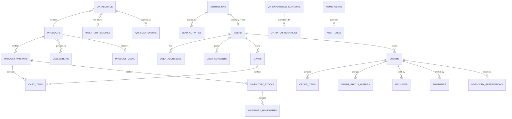

# 03. Database Design

## 1. Trạng thái tài liệu

- `CURRENT`: catalog, QR/content, submission và analytics dùng PostgreSQL qua SQLAlchemy 2.x/Psycopg 3; schema có Alembic migration; rate limit còn ở memory theo process.
- `NEXT`: mở rộng catalog visibility/collection/media và admin; distributed rate limit khi chạy nhiều instance.
- `TARGET`: mở rộng catalog, content, account, commerce, inventory, payment, fulfillment, media và audit.

Không được xem cấu trúc bảng mục tiêu là đã tồn tại trong code hiện tại.

## 2. Mục tiêu thiết kế

1. Lưu bền vững dữ liệu nghiệp vụ.
2. Bảo vệ bất biến bằng constraint và transaction.
3. Hỗ trợ audit, truy vết và migration.
4. Tách dữ liệu PII khỏi analytics công khai.
5. Cho phép chuyển dần từ seed/mock sang database mà không phá API contract.
6. Tối ưu trước cho PostgreSQL, không phụ thuộc tính năng riêng nếu chưa cần.

## 3. Quy ước chung

### 3.1. Tên

- Bảng và cột: `snake_case`.
- Bảng số nhiều: `products`, `orders`, `qr_records`.
- Khóa chính: `id`.
- Khóa ngoại: `<entity>_id`.
- Timestamp: `created_at`, `updated_at`, `deleted_at`.
- Trạng thái: `status` với `CHECK` hoặc enum được quản lý qua migration.

### 3.2. Kiểu dữ liệu

| Loại | Khuyến nghị |
| --- | --- |
| ID nội bộ | `uuid` hoặc `uuid` sinh ở application/database |
| Tiền | `bigint` theo đơn vị nhỏ nhất hoặc `numeric(18,2)` nếu đa tiền tệ |
| Timestamp | `timestamptz` |
| Email | `citext` hoặc cột normalize + unique index |
| Slug/code/SKU | `varchar` có unique index |
| Payload linh hoạt | `jsonb` |
| IP/user-agent | không lưu thô nếu không cần; ưu tiên hash/metadata tối thiểu |

### 3.3. Timestamp

- Lưu UTC bằng `timestamptz`.
- Database default `now()` cho `created_at` khi phù hợp.
- `updated_at` được cập nhật ở application hoặc trigger thống nhất.
- Không dùng local timezone trong dữ liệu lưu trữ.

### 3.4. Xóa dữ liệu

Dùng ba cơ chế khác nhau:

1. **Status nghiệp vụ**: `archived`, `revoked`, `disabled`.
2. **Soft delete**: `deleted_at` cho dữ liệu cần khôi phục hoặc privacy workflow.
3. **Hard delete**: chỉ qua retention/anonymization job và sau kiểm tra ràng buộc.

Không thêm `deleted_at` vào mọi bảng theo thói quen; bảng lịch sử/audit/event thường không soft delete.

## 4. Sơ đồ quan hệ cấp cao



## 5. Migration strategy

### 5.1. Công cụ

Khuyến nghị:

- SQLAlchemy 2.x.
- Alembic.
- PostgreSQL 16+.
- `psycopg` hoặc async driver phù hợp với kiến trúc đã chọn.

### 5.2. Quy tắc migration

1. Mỗi thay đổi schema có migration riêng.
2. Migration đã chạy production không bị sửa nội dung; tạo migration mới.
3. Tên migration mô tả hành vi, ví dụ `create_qr_registry`, `add_submission_status_index`.
4. Dùng expand/contract cho thay đổi không tương thích.
5. Không vừa rename vừa xóa cột trong một bước nếu application cũ còn chạy.
6. Migration dữ liệu lớn tách khỏi transaction dài khi cần.
7. CI chạy migration trên database sạch và kiểm tra upgrade head.

### 5.3. Expand/contract mẫu

Đổi `product_slug` sang `product_id`:

1. Thêm `product_id` nullable.
2. Deploy code ghi cả hai cột.
3. Backfill.
4. Thêm FK/index/NOT NULL.
5. Deploy code chỉ đọc `product_id`.
6. Xóa cột cũ ở release sau.

## 6. Core tables

### 6.1. `products`

| Cột | Kiểu | Ràng buộc |
| --- | --- | --- |
| `id` | uuid | PK |
| `slug` | varchar(120) | unique, not null |
| `name` | varchar(255) | not null |
| `line` | varchar(80) | nullable |
| `status` | varchar(32) | not null |
| `role` | varchar(80) | nullable |
| `tagline` | text | nullable |
| `short_description` | text | nullable |
| `description` | text | nullable |
| `seo_json` | jsonb | default `{}` |
| `primary_media_id` | uuid | nullable FK |
| `published_at` | timestamptz | nullable |
| `created_at` | timestamptz | not null |
| `updated_at` | timestamptz | not null |

Indexes:

- unique `lower(slug)` hoặc dùng slug đã normalize.
- `(status, published_at)` cho public listing.

Constraints:

- slug regex `^[a-z0-9]+(?:-[a-z0-9]+)*$`.
- status allowlist: `draft`, `active`, `archived`.

### 6.2. `product_variants`

| Cột | Kiểu | Ghi chú |
| --- | --- | --- |
| `id` | uuid | PK |
| `product_id` | uuid | FK products |
| `sku` | varchar(80) | unique |
| `name` | varchar(255) | not null |
| `status` | varchar(32) | draft/active/archived |
| `attributes_json` | jsonb | quy cách, hương vị, pack size |
| `price_amount` | bigint | VND integer |
| `compare_at_price_amount` | bigint | nullable |
| `currency` | char(3) | default `VND` |
| `weight_grams` | integer | nullable |
| `dimensions_json` | jsonb | nullable |
| `is_default` | boolean | default false |
| `created_at`, `updated_at` | timestamptz | not null |

Indexes/constraints:

- unique `sku`.
- partial unique index để mỗi product có tối đa một default variant active.
- `price_amount >= 0`.
- `compare_at_price_amount IS NULL OR compare_at_price_amount >= price_amount`.

### 6.3. `collections`

- `id`, `slug`, `name`, `description`.
- `status`, `sort_order`.
- `seo_json`.
- timestamps.

Join table `collection_products`:

- `collection_id`.
- `product_id`.
- `sort_order`.
- unique `(collection_id, product_id)`.

## 7. Content tables

### 7.1. `content_items`

- `id`.
- `type`: page, journal, policy, service, faq.
- `slug`.
- `status`: draft, in_review, published, unpublished, archived.
- `current_published_revision_id` nullable.
- `created_by`, `updated_by`.
- timestamps.

Unique:

- `(type, slug)` cho item chưa xóa.

### 7.2. `content_revisions`

- `id`.
- `content_item_id` FK.
- `revision_number` integer.
- `locale`.
- `title`.
- `summary`.
- `body_json`.
- `seo_json`.
- `status`.
- `source_notes_json`.
- `created_by`, `reviewed_by`, `published_by`.
- `created_at`, `reviewed_at`, `published_at`.

Unique:

- `(content_item_id, revision_number, locale)`.

Không update nội dung revision đã publish; tạo revision mới.

## 8. QR tables

### 8.1. `qr_records`

| Cột | Kiểu | Ràng buộc |
| --- | --- | --- |
| `id` | uuid | PK |
| `code` | varchar(80) | unique, not null |
| `product_id` | uuid | FK nullable trong giai đoạn migration |
| `product_slug_snapshot` | varchar(120) | hỗ trợ tương thích/trace |
| `batch_code` | varchar(80) | nullable |
| `content_version` | varchar(80) | not null |
| `destination` | varchar(255) | not null |
| `status` | varchar(32) | active/paused/expired/revoked |
| `active_from` | timestamptz | nullable |
| `expires_at` | timestamptz | nullable |
| `campaign` | varchar(120) | nullable |
| `locale` | varchar(10) | default `vi` |
| `created_at`, `updated_at` | timestamptz | not null |

Indexes:

- unique normalized `code`.
- `(status, expires_at)`.
- `batch_code`.
- `product_id`.

Constraints:

- code uppercase/no outer whitespace ở application; có thể thêm check.
- destination bắt đầu bằng `/experience/` hoặc thuộc allowlist cấu hình.

### 8.2. `qr_experience_contents`

- `id`.
- `product_id` hoặc `product_slug` trong migration đầu.
- `version`.
- `locale`.
- `status`: draft, in_review, published, retired.
- `content_json`.
- `source_notes_json`.
- `published_at`.
- `created_by`, `published_by`.
- timestamps.

Unique:

- `(product_id, version, locale)`.

Index public:

- `(product_id, locale, status, version)`.

### 8.3. `qr_batch_overrides`

- `id`.
- `batch_code`.
- `product_id`.
- `content_version`.
- `guidance_override_json`.
- `notice`.
- `status`.
- timestamps.

Unique:

- `(batch_code, product_id, content_version)`.

### 8.4. `qr_scan_events`

- `id` uuid/ulid.
- `qr_record_id` nullable khi invalid scan được lưu riêng.
- `qr_code_hash` hoặc normalized code theo chính sách.
- `event_name`.
- `product_id` nullable.
- `batch_code` nullable.
- `content_version`.
- `source`, `campaign`.
- `path`, `referrer_host`.
- `user_agent_family` hoặc hash.
- `ip_hash` nullable, salt xoay vòng.
- `status`.
- `created_at`.

Partition theo tháng chỉ khi volume đủ lớn.

Không lưu raw IP/referrer URL có query nhạy cảm nếu không cần.

## 9. Submission and consent tables

### 9.1. `submissions`

| Cột | Kiểu | Ghi chú |
| --- | --- | --- |
| `id` | uuid | PK |
| `public_reference` | varchar(80) | unique, không tuần tự nếu trả client |
| `kind` | varchar(40) | feedback/pre-order/... |
| `status` | varchar(32) | new/in_review/... |
| `payload_json` | jsonb | dữ liệu gốc đã validate/sanitize |
| `name` | varchar(255) | nullable, tách để tìm kiếm |
| `email_normalized` | varchar(320) | nullable |
| `phone_normalized` | varchar(40) | nullable |
| `product_id` | uuid | nullable |
| `product_slug_snapshot` | varchar(120) | nullable |
| `batch_code` | varchar(80) | nullable |
| `source` | varchar(80) | nullable |
| `assigned_to` | uuid | nullable admin user |
| `spam_score` | numeric | nullable |
| `created_at`, `updated_at` | timestamptz | not null |
| `archived_at` | timestamptz | nullable |

Indexes:

- `(kind, status, created_at desc)`.
- `(assigned_to, status)`.
- `email_normalized` nếu có nhu cầu tìm kiếm và được phép.
- GIN trên `payload_json` chỉ khi truy vấn thực tế yêu cầu.

Lưu ý:

- Public API không trả `payload_json` sau khi tạo.
- Không dùng ID tuần tự dễ đoán để public đọc submission.

### 9.2. `lead_activities`

- `id`.
- `submission_id`.
- `actor_id`.
- `activity_type`: status_change, note, contact_attempt, assignment.
- `from_status`, `to_status` nullable.
- `note` nullable.
- `created_at`.

Không sửa/xóa activity qua API thông thường.

### 9.3. `user_consents`

- `id`.
- `user_id` nullable.
- `submission_id` nullable.
- `subject_reference` nếu người chưa có account.
- `purpose`.
- `status`: granted, withdrawn.
- `policy_version`.
- `source`.
- `evidence_json` tối thiểu.
- `granted_at`, `withdrawn_at`.

Indexes:

- `(subject_reference, purpose, status)`.
- `(user_id, purpose)`.

## 10. Identity tables

### 10.1. `users`

- `id`.
- `email_normalized` unique.
- `password_hash` nullable nếu social login sau này.
- `status`.
- `email_verified_at`.
- `failed_login_count`.
- `locked_until`.
- `last_login_at`.
- `created_at`, `updated_at`, `deleted_at`.

Không lưu password reset token thô.

### 10.2. `auth_sessions`

- `id`.
- `user_id`.
- `refresh_token_hash` hoặc session secret hash.
- `device_label` nullable.
- `ip_hash`, `user_agent_hash` nếu cần.
- `expires_at`, `revoked_at`.
- timestamps.

Indexes:

- `(user_id, revoked_at, expires_at)`.
- token hash unique.

### 10.3. `verification_tokens`

- `id`.
- `user_id`.
- `purpose`: verify_email, reset_password.
- `token_hash` unique.
- `expires_at`, `used_at`.
- `created_at`.

### 10.4. `user_profiles`

- `user_id` PK/FK.
- `display_name`.
- `phone_normalized` nullable.
- `locale`.
- `marketing_preferences_json`.
- timestamps.

### 10.5. `user_addresses`

- `id`, `user_id`.
- recipient name, phone.
- address lines, ward/district/province/country code.
- `is_default`.
- timestamps, `deleted_at`.

Partial unique index:

- tối đa một default address active mỗi user.

## 11. RBAC tables

### 11.1. `roles`

- `id`, `code`, `name`, `description`, `is_system`.

### 11.2. `permissions`

- `id`, `code`, `description`.

Ví dụ:

```text
catalog.read
catalog.write
content.publish
qr.manage
submissions.read
submissions.export
orders.manage
payments.refund
inventory.adjust
users.manage
roles.manage
audit.read
```

### 11.3. Join tables

- `role_permissions(role_id, permission_id)`.
- `user_roles(user_id, role_id, granted_by, granted_at, revoked_at)`.

Unique active assignment theo `(user_id, role_id)`.

## 12. Commerce tables

### 12.1. `wishlists` và `wishlist_items`

- Một default wishlist/user ở MVP.
- Unique `(wishlist_id, variant_id)`.

### 12.2. `carts`

- `id`.
- `user_id` nullable.
- `guest_token_hash` nullable.
- `status`: active, converted, abandoned, expired.
- `currency`.
- `version` integer cho optimistic concurrency.
- `expires_at`.
- timestamps.

### 12.3. `cart_items`

- `cart_id`, `variant_id`.
- `quantity`.
- `added_price_snapshot` nullable, chỉ tham khảo.
- timestamps.

Unique `(cart_id, variant_id)`.

### 12.4. `orders`

| Cột | Kiểu | Ghi chú |
| --- | --- | --- |
| `id` | uuid | PK |
| `order_number` | varchar(40) | unique |
| `user_id` | uuid | nullable guest order |
| `status` | varchar(40) | state machine |
| `payment_status` | varchar(40) | denormalized view |
| `fulfillment_status` | varchar(40) | denormalized view |
| `currency` | char(3) | VND |
| `subtotal_amount` | bigint | >= 0 |
| `discount_amount` | bigint | >= 0 |
| `shipping_amount` | bigint | >= 0 |
| `tax_amount` | bigint | >= 0 |
| `total_amount` | bigint | >= 0 |
| `customer_email` | varchar(320) | snapshot |
| `shipping_address_json` | jsonb | snapshot |
| `billing_address_json` | jsonb | nullable |
| `idempotency_key` | varchar(128) | nullable/unique theo scope |
| `placed_at`, `cancelled_at` | timestamptz | nullable |
| timestamps | timestamptz | |

Constraints:

```text
subtotal - discount + shipping + tax = total
```

Có thể kiểm tra ở service và constraint đơn giản nếu công thức cố định.

### 12.5. `order_items`

- `id`, `order_id`.
- `product_id`, `variant_id` nullable để giữ lịch sử khi archive.
- `product_name_snapshot`.
- `variant_name_snapshot`.
- `sku_snapshot`.
- `unit_price_amount`.
- `quantity`.
- `line_discount_amount`.
- `line_total_amount`.
- `metadata_json`.

### 12.6. `order_status_history`

- `id`, `order_id`.
- `from_status`, `to_status`.
- `reason_code`, `note`.
- `actor_type`, `actor_id`.
- `created_at`.

## 13. Inventory tables

### 13.1. `inventory_locations`

- `id`, `code`, `name`, `status`.

### 13.2. `inventory_stocks`

- `id`.
- `variant_id`.
- `location_id`.
- `on_hand` bigint.
- `reserved` bigint.
- `version` integer.
- timestamps.

Unique `(variant_id, location_id)`.

Checks:

- `on_hand >= 0`.
- `reserved >= 0`.
- `reserved <= on_hand` khi backorder tắt.

### 13.3. `inventory_batches`

- `id`, `batch_code` unique.
- `variant_id` nullable.
- `manufactured_at`, `expires_at`.
- `quality_status`.
- `metadata_json`.

### 13.4. `inventory_reservations`

- `id`, `order_id`, `variant_id`, `location_id`.
- `quantity`.
- `status`: active, consumed, released, expired.
- `expires_at`.
- timestamps.

### 13.5. `inventory_movements`

- `id`.
- `variant_id`, `location_id`, `batch_id` nullable.
- `type`: receipt, reservation, release, sale, return, adjustment, damage.
- `quantity_delta` signed.
- `reference_type`, `reference_id`.
- `reason_code`.
- `actor_id` nullable.
- `created_at`.

Movement là append-only.

## 14. Payment tables

### 14.1. `payments`

- `id`, `order_id`.
- `provider`.
- `provider_payment_id`.
- `status`.
- `amount`, `currency`.
- `method_type`.
- `idempotency_key`.
- `provider_metadata_json` đã lọc.
- `authorized_at`, `paid_at`, `failed_at`.
- timestamps.

Unique:

- `(provider, provider_payment_id)`.

### 14.2. `payment_events`

- `id`.
- `provider`.
- `provider_event_id` unique.
- `event_type`.
- `signature_verified`.
- `payload_hash`.
- `processing_status`.
- `received_at`, `processed_at`.
- `error_summary`.

Không cần lưu toàn bộ webhook payload vô hạn; áp dụng retention và che PII.

### 14.3. `refunds`

- `id`, `payment_id`, `order_id`.
- `provider_refund_id`.
- `amount`.
- `status`.
- `reason_code`.
- timestamps.

## 15. Fulfillment tables

### 15.1. `shipments`

- `id`, `order_id`.
- `provider`.
- `tracking_code`.
- `status`.
- `shipping_address_json` snapshot.
- `shipped_at`, `delivered_at`.
- timestamps.

### 15.2. `shipment_events`

- `id`, `shipment_id`.
- `provider_event_id` nullable unique theo provider.
- `status`.
- `event_at`.
- `location_summary` nullable.
- `payload_hash`.
- `created_at`.

## 16. Analytics tables

### 16.1. `analytics_events`

- `id` uuid/ulid.
- `event_name`.
- `anonymous_id_hash` nullable.
- `user_id` nullable và chỉ khi chính sách cho phép.
- `product_id` nullable.
- `batch_code` nullable.
- `content_version` nullable.
- `source`, `campaign`, `path`.
- `properties_json` đã allowlist.
- `occurred_at`, `received_at`.

Indexes:

- `(event_name, occurred_at desc)`.
- `(product_id, occurred_at desc)`.

### 16.2. `analytics_daily_aggregates`

- `metric_date`.
- `metric_name`.
- dimension columns/json.
- `value` numeric.
- unique theo metric + dimensions + date.

Raw event không phải nguồn sự thật cho order/payment.

## 17. Media tables

### 17.1. `media_assets`

- `id`.
- `storage_key` unique.
- `bucket`.
- `visibility`: public/private.
- `mime_type`.
- `size_bytes`.
- `checksum`.
- `width`, `height` nullable.
- `alt_text`.
- `status`: pending, ready, quarantined, deleted.
- `uploaded_by`.
- timestamps, `deleted_at`.

### 17.2. Reference tables

Có thể dùng bảng riêng như `product_media`, `content_media` thay vì generic polymorphic FK nếu muốn ràng buộc chặt.

## 18. Notification and outbox tables

### 18.1. `outbox_events`

- `id`.
- `event_type`.
- `aggregate_type`, `aggregate_id`.
- `payload_json`.
- `status`: pending, processing, completed, failed.
- `attempt_count`.
- `available_at`, `processed_at`.
- `last_error_summary`.
- `created_at`.

Index:

- `(status, available_at)`.

### 18.2. `notification_deliveries`

- `id`.
- `channel`: email.
- `template_code`, `template_version`.
- recipient reference/normalized address theo chính sách.
- `status`.
- `provider_message_id`.
- `attempt_count`.
- timestamps.

## 19. Audit tables

### 19.1. `audit_logs`

- `id` uuid/ulid.
- `actor_type`, `actor_id`.
- `action`.
- `target_type`, `target_id`.
- `before_summary_json`.
- `after_summary_json`.
- `request_id`, `correlation_id`.
- `ip_hash` nullable.
- `created_at`.

Indexes:

- `(target_type, target_id, created_at desc)`.
- `(actor_id, created_at desc)`.
- `(action, created_at desc)`.

Audit log là append-only; quyền đọc hạn chế.

## 20. Indexing principles

1. Mọi FK được index nếu dùng join/filter thường xuyên.
2. Không tạo GIN JSONB theo thói quen; chỉ tạo khi có query thật.
3. Composite index theo thứ tự filter phổ biến, ví dụ `(status, created_at desc)`.
4. Dùng partial index cho dữ liệu active/default khi phù hợp.
5. Theo dõi query plan trước khi thêm index lớn.
6. Index làm tăng chi phí ghi; analytics volume cao cần cân bằng.

## 21. Concurrency and locking

### 21.1. Optimistic locking

Dùng cột `version` cho:

- Cart.
- Inventory stock.
- Content draft nếu nhiều editor.

Update mẫu:

```sql
UPDATE carts
SET version = version + 1, updated_at = now()
WHERE id = :id AND version = :expected_version;
```

Không có row updated -> `409 CONFLICT`.

### 21.2. Pessimistic/atomic update

Dùng cho inventory reservation hoặc operation nhạy cảm:

```sql
UPDATE inventory_stocks
SET reserved = reserved + :qty
WHERE id = :id
  AND on_hand - reserved >= :qty;
```

Kiểm tra số row affected để ngăn oversell.

## 22. Retention and anonymization

Chính sách cụ thể phải được phê duyệt; baseline đề xuất:

| Dữ liệu | Retention định hướng |
| --- | --- |
| Invalid/raw analytics | ngắn, ví dụ 30–90 ngày |
| Aggregate analytics | dài hơn theo nhu cầu báo cáo |
| Submission chưa xử lý | đến khi xử lý + thời hạn vận hành |
| Marketing consent | giữ bằng chứng trong thời gian cần thiết |
| Auth session | đến hết hạn + cửa sổ điều tra ngắn |
| Verification token | xóa sau hết hạn/đã dùng theo job |
| Order/payment | theo yêu cầu kế toán, vận hành và pháp lý áp dụng |
| Audit admin | dài hơn log ứng dụng thông thường |
| Raw application log | ngắn, không chứa PII thô |

Privacy request nên ưu tiên anonymize dữ liệu không còn cần nhận diện, thay vì phá ràng buộc lịch sử.

## 23. Backup and restore

- Backup database tự động theo môi trường production.
- Có point-in-time recovery nếu nền tảng hỗ trợ.
- Backup mã hóa và quyền truy cập tối thiểu.
- Kiểm thử restore định kỳ; backup chưa test không được coi là đáng tin cậy.
- Object storage có versioning/lifecycle nếu chứa asset quan trọng.

## 24. Seed and reference data

Seed dùng cho:

- Ba product Senova ban đầu.
- QR record thử nghiệm.
- QR experience content đã duyệt.
- System role/permission.
- Error/reference code ổn định nếu cần.

Quy tắc:

- Seed production phải idempotent.
- Không overwrite nội dung đã được admin chỉnh sửa nếu không có migration rõ.
- Seed không chứa secret hoặc PII thật.

## 25. Thứ tự triển khai schema

### Milestone DB-1 — persistence cho backend hiện tại

1. `submissions`.
2. `qr_records`.
3. `qr_experience_contents`.
4. `qr_batch_overrides`.
5. `qr_scan_events`/`analytics_events`.
6. Alembic, session, repository.

### Milestone DB-2 — catalog/content/admin cơ bản

1. `products`, `product_variants`, collection.
2. `content_items`, `content_revisions`.
3. `users`, RBAC, audit.
4. Media metadata.

### Milestone DB-3 — commerce

1. Cart/wishlist.
2. Order/order items/status history.
3. Inventory/reservation/movement.
4. Payment/webhook/refund.
5. Shipment/events.
6. Outbox/notification.

## 26. Definition of Done cho database change

- Có migration upgrade.
- Có downgrade hoặc rollback plan khả thi.
- Có constraint/index phù hợp.
- Có test migration trên database sạch.
- Có test repository/integration.
- Có đánh giá dữ liệu cũ và backfill.
- Có đánh giá lock/downtime.
- Có cập nhật tài liệu API/business rule nếu hành vi thay đổi.
- Không đưa secret hoặc PII không cần thiết vào schema/log.
