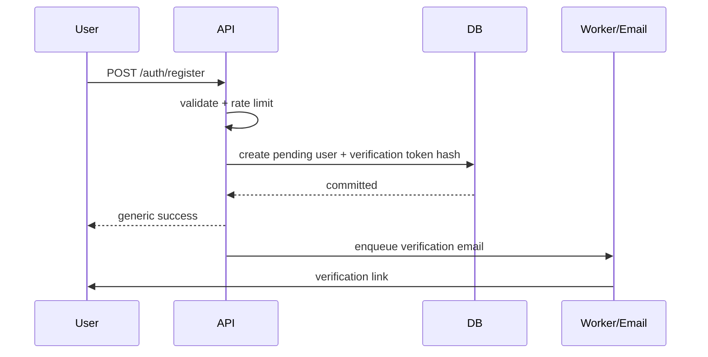

# 05. Authentication and Authorization

## 1. Trạng thái tài liệu

- `CURRENT`: backend chưa có authentication, account hoặc RBAC.
- `NEXT`: authentication tối thiểu cho admin trước khi mở back-office.
- `TARGET`: customer account, session lifecycle, RBAC chi tiết, audit và privacy workflow.

Không được triển khai admin mutation công khai chỉ vì frontend admin chưa có authentication.

## 2. Mục tiêu bảo mật

1. Xác minh đúng danh tính người dùng.
2. Chỉ cấp đúng quyền cần thiết.
3. Giảm rủi ro token/session bị đánh cắp.
4. Chống account enumeration, brute force và session fixation.
5. Có khả năng thu hồi session và điều tra hành động admin.
6. Không đưa secret hoặc credential vào log.

## 3. Actor

| Actor | Mô tả |
| --- | --- |
| Anonymous visitor | Xem nội dung, catalog, QR; gửi form theo rate limit. |
| Customer | Quản lý hồ sơ, wishlist, cart, order và privacy request của chính mình. |
| Content Editor | Soạn/sửa nội dung nhưng không nhất thiết được publish. |
| Content Approver | Duyệt và publish nội dung. |
| Catalog Manager | Quản lý product, variant, collection và giá. |
| QR Manager | Quản lý QR registry, content version và batch override. |
| Lead Operator | Xem và xử lý submission/lead theo phạm vi. |
| Order Operator | Xử lý order và fulfillment. |
| Inventory Operator | Xem/điều chỉnh tồn kho. |
| Finance Operator | Xem payment và thực hiện refund theo quyền. |
| Analyst | Xem dashboard/export được phép, ưu tiên dữ liệu tổng hợp. |
| Administrator | Quản lý user/role/config trong phạm vi được giao. |
| System Worker | Xử lý job nội bộ với machine credential riêng. |
| External Provider | Gửi webhook có chữ ký, không dùng user session. |

## 4. Authentication strategy

### 4.1. Khuyến nghị cho web cùng first-party domain

Ưu tiên một trong hai mô hình:

#### Mô hình A — Session cookie

- Session ID/secret ngẫu nhiên trong cookie.
- Cookie `HttpOnly`, `Secure`, `SameSite=Lax/Strict` phù hợp.
- Server lưu session state hoặc hash token.
- Bảo vệ CSRF cho unsafe method.

Ưu điểm:

- Dễ thu hồi.
- Giảm token exposure trong JavaScript.
- Phù hợp admin web first-party.

#### Mô hình B — Access token + refresh cookie

- Access token ngắn hạn dùng Bearer.
- Refresh token trong HttpOnly Secure cookie.
- Refresh token rotation.
- Reuse detection.

Ưu điểm:

- Phù hợp API đa client.
- Dễ tách frontend/backend domain.

Không lưu refresh token trong `localStorage`.

### 4.2. Quyết định cần chốt trước khi code

- Frontend/backend có cùng site không.
- Có mobile app hoặc third-party client không.
- Có social login không.
- Hạ tầng session store có sẵn không.
- Yêu cầu logout-all và thu hồi tức thời.

## 5. Password policy

Baseline:

- Tối thiểu 12 ký tự hoặc passphrase tương đương.
- Cho phép độ dài lớn, tối thiểu 64–128 ký tự.
- Không ép đổi password định kỳ nếu không có dấu hiệu compromise.
- Không dùng rule bắt buộc kiểu “1 chữ hoa + 1 ký tự đặc biệt” như biện pháp duy nhất.
- Kiểm tra password phổ biến/bị lộ nếu có nguồn phù hợp.
- Cho phép password manager và paste.

Hash:

- Argon2id ưu tiên.
- bcrypt chỉ khi cấu hình cost phù hợp và xử lý giới hạn độ dài rõ.
- Salt riêng tự động theo thuật toán.
- Có khả năng rehash khi policy thay đổi.

Không:

- Mã hóa reversible password.
- Log password.
- Gửi password qua email.
- Lưu password hint.

## 6. Registration

Luồng:



Business rules:

1. Normalize email trước unique check.
2. Không cho client chọn role.
3. Ghi nhận terms version riêng với marketing consent.
4. Verification token single-use và có hạn.
5. Gửi lại verification có cooldown/rate limit.
6. Nếu email đã tồn tại, phản hồi phải cân bằng UX và chống enumeration theo threat model.

## 7. Login

Luồng:

1. Normalize email.
2. Kiểm tra rate limit theo IP và account key.
3. Lấy user nếu có; thực hiện timing-safe flow.
4. Verify password hash.
5. Kiểm tra account status.
6. Tạo session mới và rotate nếu cần.
7. Ghi `last_login_at`.
8. Audit login admin; log security event tối thiểu.

Errors public:

- `INVALID_CREDENTIALS` cho email/password sai.
- `ACCOUNT_LOCKED` khi policy cho phép thông báo.
- `ACCOUNT_DISABLED`.
- `EMAIL_NOT_VERIFIED` nếu bắt buộc.

Không trả:

- “Email không tồn tại” và “Mật khẩu sai” thành hai lỗi khác nhau ở endpoint nhạy cảm.

## 8. Brute-force protection

Kết hợp:

- Rate limit theo IP.
- Rate limit theo normalized account key.
- Progressive delay hoặc temporary lock.
- CAPTCHA/challenge chỉ khi rủi ro tăng, không mặc định làm giảm UX.
- Alert cho pattern bất thường.

Không dùng khóa vĩnh viễn dễ bị lợi dụng để DoS tài khoản.

## 9. Email verification

Token requirements:

- Random cryptographic token đủ entropy.
- Chỉ lưu hash trong DB nếu có thể.
- Có `purpose`, `expires_at`, `used_at`.
- Single-use.
- Link dùng HTTPS.

Confirm flow:

1. Hash token nhận được.
2. Tìm token chưa dùng, chưa hết hạn, đúng purpose.
3. Transaction: mark token used + verify email.
4. Revoke token cùng purpose còn lại nếu cần.
5. Không tự động cấp admin role.

## 10. Password reset

Request endpoint luôn trả response trung tính:

```json
{
  "success": true,
  "data": {
    "accepted": true
  }
}
```

Luồng confirm:

1. Validate token.
2. Kiểm tra password policy.
3. Update password hash.
4. Mark token used.
5. Revoke tất cả session hoặc tối thiểu session khác theo policy.
6. Gửi security notification.
7. Audit với admin account.

## 11. Session lifecycle

Session record tối thiểu:

- `id`.
- `user_id`.
- token/refresh hash.
- `issued_at`.
- `expires_at`.
- `last_seen_at` nếu cần.
- `revoked_at`.
- device/user-agent summary tối thiểu.

Rules:

1. Session có absolute expiry.
2. Có idle expiry nếu phù hợp admin.
3. Refresh token rotation nếu dùng refresh token.
4. Token cũ bị đánh dấu thay thế/revoked.
5. Reuse token cũ sau rotation -> revoke session family và security event.
6. Logout là revoke server-side, không chỉ xóa client storage.
7. Logout-all revoke mọi session trừ session hiện tại hoặc tất cả theo lựa chọn rõ.

## 12. Cookie requirements

Production:

```text
HttpOnly=true
Secure=true
SameSite=Lax hoặc Strict
Path=/
Domain chỉ đặt khi thật sự cần
```

Nếu cross-site bắt buộc:

- `SameSite=None; Secure`.
- CORS credential chặt.
- CSRF protection bắt buộc.

Không đặt domain cookie quá rộng nếu nhiều subdomain không cùng mức tin cậy.

## 13. CSRF protection

Áp dụng khi authentication dựa trên cookie và browser tự gửi credential.

Biện pháp:

- SameSite phù hợp.
- CSRF token cho POST/PUT/PATCH/DELETE.
- Validate `Origin`/`Referer` ở request nhạy cảm.
- Không dùng GET cho mutation.

Webhook không dùng CSRF; dùng chữ ký provider.

## 14. JWT requirements nếu sử dụng

Access token claim tối thiểu:

```json
{
  "sub": "user-id",
  "sid": "session-id",
  "iss": "senova-api",
  "aud": "senova-web",
  "iat": 0,
  "exp": 0,
  "jti": "token-id"
}
```

Rules:

- Verify algorithm allowlist, không tin `alg` tùy ý.
- Verify issuer, audience, expiry.
- Key rotation có `kid`.
- Access token ngắn hạn.
- Không nhét PII hoặc permission list quá lớn vào token.
- Permission thay đổi cần có cơ chế hiệu lực đủ nhanh; dùng session/version hoặc TTL ngắn.

## 15. Authorization model

Dùng RBAC kết hợp ownership và context rule:

```text
Allowed = authenticated
       AND account active
       AND has required permission
       AND satisfies resource ownership/scope rule
       AND resource state permits action
```

Ví dụ:

- Customer có `orders.read_own`, nhưng chỉ đọc order `user_id` của chính mình.
- Lead Operator có `submissions.read`, nhưng export cần `submissions.export` riêng.
- Content Editor có `content.write`, nhưng publish cần `content.publish`.
- Inventory Operator có `inventory.adjust`, nhưng adjustment lớn có thể cần approval bổ sung.

## 16. Permission naming

Quy ước:

```text
<resource>.<action>
```

Danh mục đề xuất:

### Catalog

- `catalog.read`
- `catalog.write`
- `catalog.publish`
- `catalog.archive`
- `pricing.write`

### Content

- `content.read`
- `content.write`
- `content.review`
- `content.publish`
- `content.unpublish`

### QR

- `qr.read`
- `qr.write`
- `qr.activate`
- `qr.pause`
- `qr.revoke`
- `qr.analytics.read`

### Submission

- `submissions.read`
- `submissions.write`
- `submissions.assign`
- `submissions.export`
- `submissions.delete_or_anonymize`

### Commerce

- `orders.read`
- `orders.manage`
- `orders.cancel`
- `orders.export`
- `payments.read`
- `payments.refund`
- `shipments.manage`

### Inventory

- `inventory.read`
- `inventory.adjust`
- `inventory.receive`

### User/RBAC

- `users.read`
- `users.manage`
- `roles.read`
- `roles.manage`

### Analytics/media/audit

- `analytics.read`
- `analytics.export`
- `media.read`
- `media.write`
- `audit.read`

## 17. Default role matrix

| Permission group | Viewer | Content Editor | Content Approver | QR Manager | Lead Operator | Order Operator | Inventory Operator | Finance | Admin |
| --- | --- | --- | --- | --- | --- | --- | --- | --- | --- |
| Catalog read | ✓ | ✓ | ✓ | ✓ | ✓ | ✓ | ✓ | ✓ | ✓ |
| Catalog write |  |  |  |  |  |  |  |  | ✓ |
| Content write |  | ✓ | ✓ |  |  |  |  |  | ✓ |
| Content publish |  |  | ✓ |  |  |  |  |  | ✓ |
| QR manage |  |  |  | ✓ |  |  |  |  | ✓ |
| Submission read/write |  |  |  |  | ✓ |  |  |  | ✓ |
| Submission export |  |  |  |  | optional |  |  |  | ✓ |
| Order manage |  |  |  |  |  | ✓ |  |  | ✓ |
| Inventory adjust |  |  |  |  |  |  | ✓ |  | ✓ |
| Payment refund |  |  |  |  |  |  |  | ✓ | ✓ |
| User/RBAC manage |  |  |  |  |  |  |  |  | ✓ |
| Audit read |  |  |  |  |  |  |  | optional | ✓ |

Đây là baseline; production cần chốt theo nhân sự thật. Không gán tất cả quyền cho “Admin” nếu có thể tách nhiệm vụ.

## 18. Separation of duties

Các thao tác nên tách quyền:

- Soạn nội dung và publish nội dung.
- Xử lý order và refund.
- Điều chỉnh tồn kho và phê duyệt adjustment lớn.
- Quản lý user và quản lý role.
- Xem submission và export PII diện rộng.

Nếu đội nhỏ chưa tách người, vẫn tách permission để có thể mở rộng và audit.

## 19. Ownership rules

### Customer resources

- `/me/*`: chỉ current user.
- Address: `address.user_id == current_user.id`.
- Wishlist/cart: ownership hoặc guest token hợp lệ.
- Order: current user hoặc guest access token scoped đúng order.

### Admin resources

- Không dùng client-supplied owner ID để bỏ qua scope.
- Nếu sau này có tổ chức/chi nhánh, thêm scope rõ thay vì dựa vào role name.

## 20. Guest access

Cho phép guest:

- Gửi submission.
- Dùng cart bằng guest token.
- Tạo order guest nếu transactional mode bật.
- Xem order bằng opaque guest access token hoặc xác minh email/OTP.

Không cho phép:

- Đọc order chỉ bằng order number.
- Đọc submission chỉ bằng ID.
- Sửa dữ liệu guest sau khi token hết hạn.

Guest token:

- Đủ entropy.
- Scope resource cụ thể.
- Có hạn.
- Có thể rotate/revoke.
- Không log thô.

## 21. Admin authentication hardening

Khuyến nghị:

- MFA cho admin, đặc biệt role có refund/RBAC/export.
- Session ngắn hơn customer.
- Step-up authentication cho refund lớn, đổi role hoặc export PII lớn.
- IP allowlist chỉ dùng nếu mô hình vận hành phù hợp, không thay MFA.
- Security notification khi login thiết bị mới hoặc thay đổi quyền.

## 22. MFA — `TARGET/OPTIONAL`

Ưu tiên:

1. TOTP authenticator.
2. WebAuthn/passkey nếu có nguồn lực.
3. Recovery codes dùng một lần.

Không ưu tiên SMS làm yếu tố duy nhất cho admin nhạy cảm.

Recovery:

- Recovery code chỉ hiển thị một lần, lưu hash.
- Reset MFA cần quy trình xác minh và audit.

## 23. Service-to-service authentication

Worker/internal service:

- Dùng machine identity riêng.
- Credential trong secret manager.
- Scope tối thiểu.
- Rotate được.
- Không dùng admin user token.

Nếu cùng process modular monolith, gọi service trực tiếp thay vì HTTP nội bộ không cần thiết.

## 24. Webhook authentication

Mỗi provider adapter phải:

1. Đọc raw body.
2. Verify signature theo tài liệu provider.
3. Kiểm tra timestamp/replay window nếu có.
4. Deduplicate theo provider event ID.
5. Không tin status/payment amount nếu signature sai.
6. Log event ID và kết quả, không log payload nhạy cảm.

Lỗi signature:

- `401/400 WEBHOOK_SIGNATURE_INVALID` theo provider contract.
- Không đưa chi tiết key/expected signature vào response.

## 25. API key — chỉ khi cần

Không dùng API key cho customer browser.

Có thể dùng cho:

- Partner integration server-to-server.
- Internal automation.

Rules:

- Prefix hiển thị + secret phần còn lại.
- Chỉ lưu hash.
- Scope, owner, created_at, expires_at, last_used_at.
- Rotate/revoke.
- Rate limit riêng.

## 26. Authorization implementation in FastAPI

Cấu trúc đề xuất:

```python
CurrentUser = Annotated[UserPrincipal, Depends(get_current_user)]


def require_permission(code: str):
    async def dependency(user: CurrentUser) -> UserPrincipal:
        if code not in user.permissions:
            raise permission_denied()
        return user
    return dependency
```

Route:

```python
@router.post(
    "/admin/content-revisions/{revision_id}/publish",
    dependencies=[Depends(require_permission("content.publish"))],
)
async def publish_revision(...):
    return await service.publish(...)
```

Lưu ý:

- Dependency kiểm tra permission chung.
- Service vẫn kiểm tra ownership/state/business rule.
- Không chỉ ẩn button ở frontend.

## 27. Security context

Application service nhận principal trừu tượng:

```python
class ActorContext:
    actor_id: UUID | None
    actor_type: Literal["anonymous", "customer", "admin", "system"]
    permissions: set[str]
    session_id: UUID | None
    request_id: str
```

Service không phụ thuộc trực tiếp FastAPI `Request`.

## 28. Account status behavior

| Status | Login | Read own data | Mutation | Admin access |
| --- | --- | --- | --- | --- |
| `pending_verification` | hạn chế | hạn chế | hạn chế | không |
| `active` | có | có | có | theo role |
| `locked` | không | session cũ nên revoke | không | không |
| `disabled` | không | theo privacy/support flow | không | không |
| `deleted` | không | không qua normal API | không | không |

## 29. Role/permission changes

Rules:

1. Chỉ actor có `roles.manage`.
2. Không cho actor tự xóa role cuối cùng có quyền quản trị nếu làm hệ thống mất quản trị viên.
3. Không cho actor cấp permission ngoài phạm vi quyền của mình nếu dùng delegated admin.
4. Mọi grant/revoke có audit.
5. Permission thay đổi phải có hiệu lực sau thời gian ngắn; invalidate cache/session version nếu cần.
6. Không nhận role name tùy ý từ client mà không validate ID/code.

## 30. Error behavior

| Code | HTTP | Khi dùng |
| --- | --- | --- |
| `AUTHENTICATION_REQUIRED` | 401 | Không có credential |
| `TOKEN_INVALID` | 401 | Token sai/hết hạn/revoked |
| `INVALID_CREDENTIALS` | 401 | Login sai |
| `EMAIL_NOT_VERIFIED` | 403 | Tài khoản chưa xác minh nếu policy yêu cầu |
| `ACCOUNT_LOCKED` | 423 hoặc 403 | Tạm khóa; chọn một chuẩn nhất quán |
| `ACCOUNT_DISABLED` | 403 | Tài khoản bị vô hiệu |
| `PERMISSION_DENIED` | 403 | Thiếu permission |
| `RESOURCE_NOT_FOUND` | 404 | Không lộ resource ngoài scope |
| `CSRF_VALIDATION_FAILED` | 403 | CSRF token/origin sai |
| `MFA_REQUIRED` | 403 | Cần step-up/MFA |
| `SESSION_REAUTH_REQUIRED` | 401/403 | Session quá cũ cho action nhạy cảm |

Không trả permission list nội bộ chi tiết cho anonymous.

## 31. Audit requirements

Audit bắt buộc:

- Admin login success/failure theo mức phù hợp.
- MFA enrollment/reset.
- Password reset admin.
- Session revoke-all.
- User lock/unlock/disable.
- Role/permission grant/revoke.
- Impersonation nếu sau này có.
- Export PII.
- Step-up auth failure ở action nhạy cảm.

Audit không ghi password, token, OTP hoặc secret.

## 32. Impersonation — mặc định ngoài phạm vi

Chỉ triển khai nếu support cần và phải có:

- Permission riêng.
- Lý do bắt buộc.
- Banner rõ cho admin.
- Không cho thực hiện payment/refund/security change trong session impersonation trừ quy trình đặc biệt.
- Audit đầy đủ actor thật và subject user.
- Thời hạn ngắn.

## 33. Privacy considerations

- Authentication log chỉ giữ metadata cần thiết.
- Không lưu IP thô lâu dài nếu không có mục đích rõ.
- User có thể xem/revoke session của mình nếu feature hỗ trợ.
- Account deletion không phá order/audit bắt buộc; dùng anonymization.
- Consent marketing độc lập authentication/terms.

## 34. Test cases tối thiểu

### Register/verify

- Email hợp lệ tạo pending user.
- Email normalize trùng bị xử lý đúng.
- Password yếu bị từ chối.
- Verification token sai/hết hạn/đã dùng.
- Token chỉ dùng một lần.

### Login/session

- Login đúng/sai.
- Không phân biệt email không tồn tại qua message/timing bất hợp lý.
- Account locked/disabled.
- Refresh rotation.
- Reuse refresh token cũ.
- Logout và logout-all.
- Session hết hạn.

### Password reset

- Request luôn generic.
- Token invalid/expired/used.
- Reset revoke session theo policy.

### Authorization

- Anonymous -> 401.
- Authenticated thiếu quyền -> 403.
- Có quyền nhưng resource không thuộc owner -> 404/403 theo policy.
- Editor không publish.
- Lead operator không refund.
- Finance refund nhưng không quản lý role.
- Role change invalidate permission cache.

### CSRF/CORS

- Cookie auth mutation thiếu CSRF bị chặn.
- Origin không cho phép bị chặn.
- Preflight hợp lệ hoạt động.

## 35. Definition of Done

Authentication/authorization chỉ hoàn thành khi:

- Credential lưu và truyền an toàn.
- Có rate limit/brute-force control.
- Có session revoke.
- Có test security paths.
- Có permission matrix.
- Backend enforce permission, không chỉ frontend.
- Có audit action quan trọng.
- Không log password/token/OTP.
- Có secret rotation và incident procedure.
- OpenAPI mô tả security scheme đúng behavior thật.
