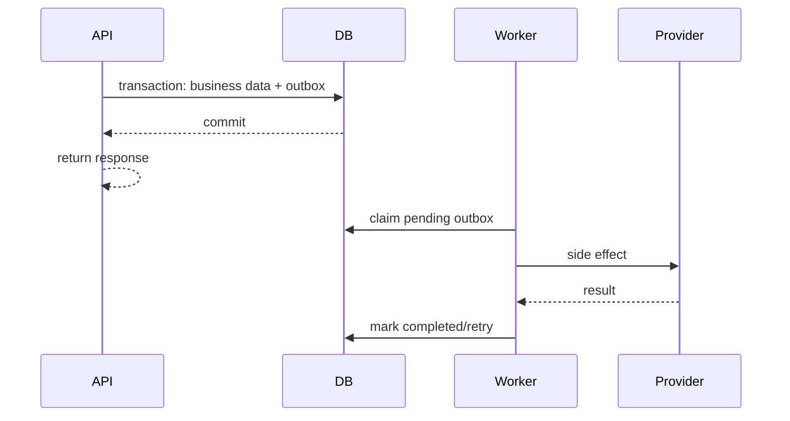

# 06. Cross-Cutting Concerns

## 1. Trạng thái tài liệu

- `CURRENT`: cấu hình qua environment, CORS, response envelope, sanitize text, rate limit in-memory.
- `NEXT`: settings typed, error middleware, PostgreSQL persistence, Redis rate limit/cache, request ID và structured logging.
- `TARGET`: idempotency, outbox/jobs, provider adapters, upload pipeline, feature flags và resilience đầy đủ.

## 2. Configuration management

### 2.1. Nguyên tắc

1. Cấu hình khác nhau theo môi trường; code không chứa secret.
2. Parse và validate cấu hình lúc startup, fail fast nếu thiếu biến bắt buộc.
3. Không đọc `os.getenv()` rải rác trong domain logic.
4. Secret không xuất hiện trong error, log, OpenAPI hoặc health response.
5. Biến môi trường có tên rõ, prefix nhất quán khi cần.

### 2.2. Settings đề xuất

```python
from pydantic_settings import BaseSettings, SettingsConfigDict

class Settings(BaseSettings):
    app_env: str = "local"
    api_prefix: str = "/api/v1"
    database_url: str
    redis_url: str | None = None
    frontend_origins: list[str]
    log_level: str = "INFO"
    submission_rate_limit_per_minute: int = 10
    analytics_rate_limit_per_minute: int = 120
    qr_scan_rate_limit_per_minute: int = 60

    model_config = SettingsConfigDict(
        env_file=".env",
        case_sensitive=False,
    )
```

### 2.3. Nhóm cấu hình

- App/runtime.
- Database/pool.
- Redis/cache/rate limit.
- CORS/trusted hosts.
- Session/JWT/key rotation.
- Email provider.
- Object storage/CDN.
- Payment/shipping provider.
- Observability.
- Feature flags.
- Retention/job schedule.

## 3. Environment model

| Môi trường | Mục đích | Dữ liệu |
| --- | --- | --- |
| `local` | Phát triển cá nhân | seed/synthetic |
| `test` | Unit/integration/CI | ephemeral |
| `staging` | Kiểm thử gần production | synthetic/masked |
| `production` | Người dùng thật | dữ liệu thật có kiểm soát |

Không copy database production nguyên trạng sang local/staging.

## 4. Request context và correlation

Mỗi request có:

- `request_id`.
- `correlation_id` nếu đi qua nhiều job/service.
- actor/session ID nếu có.
- route template.
- start time.

Quy tắc:

1. Nhận `X-Request-ID` nếu hợp lệ, nếu không sinh mới.
2. Trả lại `X-Request-ID` trong response.
3. Gắn request ID vào log, audit và outbox event.
4. Không dùng request ID do client cung cấp trực tiếp làm khóa bảo mật.

## 5. Error handling

### 5.1. Phân loại

- Validation error.
- Authentication/authorization error.
- Domain/business error.
- Conflict/concurrency error.
- Dependency/provider error.
- Unexpected internal error.

### 5.2. Domain exception

```python
class DomainError(Exception):
    def __init__(
        self,
        code: str,
        message: str,
        status_code: int = 400,
        details: list[dict] | None = None,
    ):
        ...
```

### 5.3. Quy tắc

- Route không tự tạo response lỗi khác nhau tùy người viết.
- Middleware/exception handler chuẩn hóa envelope.
- Log internal exception với request ID; client chỉ nhận message an toàn.
- Không trả stack trace ở production.
- Không dùng `500` cho lỗi nghiệp vụ dự kiến.

## 6. Input validation

### 6.1. Nhiều lớp

1. Pydantic schema: kiểu, format, length.
2. Application service: business rule và cross-resource validation.
3. Database: unique, FK, check, not null.
4. Provider adapter: contract của external service.

### 6.2. Text

- Trim whitespace.
- Giới hạn độ dài.
- Normalize line ending nếu cần.
- Không xem việc xóa `<` và `>` là biện pháp chống XSS đầy đủ.
- Escape output theo context ở frontend/template.
- Rich text phải đi qua sanitizer chuyên dụng với allowlist.

### 6.3. Email/phone

- Email dùng validator chuẩn, normalize cho lookup.
- Không biến đổi email tùy tiện theo provider-specific rule.
- Phone normalize theo quốc gia khi feature cần; vẫn giữ bản hiển thị nếu cần.

### 6.4. Enum/status

- Dùng allowlist.
- Không nhận status tùy ý ở generic PATCH.
- State transition qua action endpoint/service rõ.

## 7. Serialization conventions

- API JSON dùng `camelCase` để tương thích frontend hiện tại.
- Python/database dùng `snake_case`.
- Alias mapping tập trung trong schema.
- Timestamp ISO 8601 UTC, ví dụ `2026-07-13T15:30:00Z`.
- Tiền trả bằng integer amount + currency:

```json
{
  "amount": 350000,
  "currency": "VND"
}
```

Không dùng float cho tiền.

## 8. Rate limiting

### 8.1. `CURRENT`

Rate limit đang lưu bucket trong memory theo process. Hạn chế:

- Mất khi restart.
- Không đồng bộ nhiều worker/instance.
- Không phù hợp production scale-out.

### 8.2. `NEXT/TARGET`

Dùng Redis hoặc gateway có atomic operation.

Key gợi ý:

```text
rl:<scope>:<ip-hash-or-user-id>:<window>
```

Baseline:

| Endpoint | Limit định hướng |
| --- | --- |
| Submission | 10/phút/IP |
| QR scan | 60/phút/IP |
| Analytics | 120/phút/IP hoặc anonymous ID |
| Login | thấp hơn, kết hợp account key |
| Password reset request | thấp, theo IP + email hash |
| Upload intent | theo user |
| Export | theo admin |

Giá trị thực tế phải đo và cấu hình.

### 8.3. Response

```http
HTTP/1.1 429 Too Many Requests
Retry-After: 60
```

```json
{
  "success": false,
  "error": {
    "code": "RATE_LIMITED",
    "message": "Quá nhiều yêu cầu. Vui lòng thử lại sau."
  }
}
```

### 8.4. Không dựa chỉ vào IP

- NAT có thể gom nhiều user.
- IPv6 cần normalize.
- Proxy header chỉ tin từ trusted proxy.
- Auth endpoint nên kết hợp IP, account key và behavioral signal.

## 9. Idempotency

### 9.1. Endpoint cần áp dụng

- Create order.
- Create payment.
- Refund.
- Provider webhook.
- Export job.
- Email resend nhạy cảm nếu retry có side effect.

### 9.2. Data model

`idempotency_keys`:

- `id`.
- `scope`.
- `actor_key`.
- `key`.
- `request_hash`.
- `status`: processing/completed/failed.
- `response_status`.
- `response_body_json` hoặc resource reference.
- `expires_at`.
- timestamps.

Unique:

```text
(scope, actor_key, key)
```

### 9.3. Algorithm

1. Validate key format/length.
2. Hash canonical request payload.
3. Insert row `processing` atomically.
4. Nếu đã tồn tại:
   - cùng hash + completed -> replay response.
   - cùng hash + processing -> trả `409/202` theo contract.
   - khác hash -> `IDEMPOTENCY_CONFLICT`.
5. Thực hiện transaction nghiệp vụ.
6. Lưu response/resource reference.

Không giữ DB transaction mở trong lúc gọi provider lâu.

## 10. Concurrency control

### 10.1. Optimistic locking

Dùng `version`/ETag cho:

- Cart.
- Product/content draft.
- Inventory snapshot khi phù hợp.

### 10.2. Atomic update/row lock

Dùng cho:

- Inventory reservation.
- Sequence/order number nếu database-managed.
- Payment state transition.

### 10.3. State machine

Update dạng:

```sql
UPDATE orders
SET status = 'confirmed'
WHERE id = :id AND status IN ('pending', 'paid');
```

Số row bằng 0 -> state conflict hoặc not found, cần phân biệt an toàn.

## 11. Transaction boundaries

Một transaction nên bao gồm các thay đổi local cần nhất quán:

- Tạo submission + activity đầu tiên.
- Publish content + update current revision + audit + outbox.
- Tạo order + item snapshot + status history + inventory reservation + outbox.
- Payment webhook local state + order transition + outbox.
- Refund record + payment/order state + audit.

Không gọi email/payment/shipping provider khi đang giữ lock/transaction dài.

## 12. Outbox pattern

### 12.1. Mục đích

Tránh tình huống database commit thành công nhưng email/event không được gửi, hoặc ngược lại.

### 12.2. Luồng



### 12.3. Rules

- Worker claim bằng `FOR UPDATE SKIP LOCKED` hoặc queue tương đương.
- Job idempotent.
- Exponential backoff + jitter.
- Dead-letter/manual review sau max attempts.
- Không lưu secret trong payload.

## 13. Background jobs

Các job dự kiến:

- Gửi email verification/reset/receipt.
- Gửi notification order.
- Aggregate analytics.
- Expire cart/reservation/token/session.
- Retry provider sync.
- Generate media thumbnail.
- Export CSV.
- Retention/anonymization.
- Backup verification/reporting.

Job contract:

- `job_id`.
- `job_type`.
- schema version.
- payload tối thiểu.
- attempt count.
- scheduled/available time.
- correlation ID.

## 14. Retry policy

Chỉ retry lỗi có khả năng tạm thời:

- Timeout.
- 429.
- 502/503/504.
- Network reset.

Không retry tự động:

- 400 validation.
- 401/403 do credential sai, trừ khi có refresh flow rõ.
- Business conflict.

Backoff mẫu:

```text
1s, 2s, 4s, 8s, 16s + jitter
```

Giới hạn tổng thời gian và attempt theo tác vụ.

## 15. External provider adapters

Interface ví dụ:

```python
class EmailProvider(Protocol):
    async def send(self, message: EmailMessage) -> ProviderResult: ...

class PaymentProvider(Protocol):
    async def create_payment(self, command: CreatePayment) -> PaymentResult: ...
    def verify_webhook(self, raw_body: bytes, headers: Mapping[str, str]) -> VerifiedEvent: ...
```

Rules:

- Domain không import SDK provider trực tiếp.
- Map provider status/error sang internal code.
- Timeouts bắt buộc.
- Không log provider payload thô nếu có PII/secret.
- Có sandbox adapter và fake adapter cho test.

## 16. Circuit breaker và resilience

Chỉ thêm circuit breaker khi có provider call thường xuyên và lỗi lặp gây cascade.

Baseline trước:

- Timeout ngắn, rõ.
- Retry có giới hạn.
- Bulkhead/concurrency limit cho job.
- Queue cho side effect.
- Degraded mode.

Ví dụ degraded mode:

- Email provider lỗi: submission vẫn lưu, email gửi sau.
- Analytics lỗi: trải nghiệm chính vẫn hoạt động.
- Payment provider lỗi: order giữ trạng thái pending, không đánh dấu paid.

## 17. Caching

### 17.1. Candidate

- Product list/detail public.
- Collection.
- Published content.
- QR experience content đã publish.
- Permission set ngắn hạn nếu có invalidation.

### 17.2. Không cache shared

- Profile.
- Address.
- Cart.
- Order.
- Payment.
- Submission detail.
- Admin response chứa PII.

### 17.3. Cache-aside

```text
read cache -> miss -> read DB -> set cache -> return
```

Invalidation khi publish/update:

- Xóa key theo resource/version.
- Hoặc dùng namespace version.

### 17.4. Key

```text
senova:v1:product:<slug>:<locale>
senova:v1:content:<type>:<slug>:<locale>:<revision>
senova:v1:qr-content:<product>:<version>:<locale>:<batch>
```

Không đưa PII thô vào key.

## 18. HTTP caching

Public GET:

- `ETag`.
- `Last-Modified` khi phù hợp.
- `Cache-Control`.
- `stale-while-revalidate` cho content ít đổi.

Protected/PII:

```http
Cache-Control: no-store
```

## 19. CORS

Rules:

1. Production dùng exact origin allowlist.
2. Không dùng `*` khi `allow_credentials=true`.
3. Chỉ mở method/header cần thiết.
4. Không xem CORS là authorization; non-browser client không bị CORS chặn.
5. Cấu hình staging/production tách riêng.

Baseline:

```python
CORSMiddleware(
    allow_origins=settings.frontend_origins,
    allow_credentials=True,
    allow_methods=["GET", "POST", "PATCH", "DELETE", "OPTIONS"],
    allow_headers=["Authorization", "Content-Type", "X-Request-ID", "Idempotency-Key", "If-Match", "X-CSRF-Token"],
)
```

## 20. Trusted hosts và proxy

- Dùng trusted host middleware/gateway allowlist.
- Chỉ tin `X-Forwarded-For`, `X-Forwarded-Proto` từ reverse proxy tin cậy.
- Cấu hình HTTPS redirect ở gateway/app tùy hạ tầng.
- Không dùng header client tùy ý để xây absolute URL nhạy cảm.

## 21. File upload

### 21.1. Luồng presigned ưu tiên

1. Admin gọi `upload-intents` với filename, MIME, size, checksum.
2. Backend kiểm tra permission/quota/type.
3. Tạo media record `pending`.
4. Trả presigned URL có hạn.
5. Client upload trực tiếp storage.
6. Client gọi complete hoặc storage event kích hoạt.
7. Worker kiểm tra metadata/scan/generate thumbnail.
8. Media chuyển `ready`.

### 21.2. Validation

- Size tối đa theo loại.
- MIME allowlist.
- Không chỉ tin extension/Content-Type client.
- Magic bytes/content sniffing khi cần.
- Image decode/re-encode để giảm payload độc hại nếu quy trình phù hợp.
- Filename không dùng trực tiếp làm storage key.
- Storage key random/UUID.

### 21.3. Visibility

- Public asset: CDN URL sau khi ready.
- Private export/file: signed URL ngắn hạn.
- Quarantine asset không public.

## 22. Email

### 22.1. Template

Mỗi template có:

- `code`.
- version.
- locale.
- subject.
- HTML/text body.
- required variables.

### 22.2. Types

- Email verification.
- Password reset.
- Submission receipt nếu cần.
- Lead notification nội bộ.
- Order confirmation/status.
- Payment/refund.
- Shipment.
- Security alert.

### 22.3. Rules

- Gửi qua job/outbox.
- Escape variable.
- Không đưa dữ liệu nhạy cảm quá mức vào subject.
- Link token có hạn.
- Không log full recipient + body ở production.
- Track delivery chỉ trong phạm vi consent/mục đích phù hợp.

## 23. Search

Giai đoạn đầu:

- PostgreSQL `ILIKE`, trigram hoặc full-text search.
- Search input length limit.
- Query timeout.
- Rank + deterministic tie-breaker.

Chỉ thêm Elasticsearch/OpenSearch/Meilisearch khi:

- Số content đủ lớn.
- Cần typo tolerance/facet/ranking phức tạp.
- Có năng lực vận hành index sync.

## 24. Localization

- API nhận `locale` query hoặc `Accept-Language`.
- Locale allowlist: ban đầu `vi`, có thể thêm `en`.
- Fallback rõ: `requested -> default vi -> not found`, không trộn đoạn văn nhiều locale.
- Error message localization tách khỏi error code.
- Content revision theo locale.
- Time/number formatting do frontend đảm nhiệm; API trả dữ liệu chuẩn.

## 25. Time and scheduling

- Lưu UTC.
- Input có offset hoặc `Z`.
- Business calendar/timezone hiển thị dùng `Asia/Ho_Chi_Minh` nếu phù hợp.
- Expiry so sánh bằng UTC.
- Test boundary ở đúng thời điểm hết hạn.
- Không dùng naive datetime trong domain persistence.

## 26. Money and rounding

- VND dùng integer đồng.
- Không dùng float.
- Discount/tax calculation có thứ tự rõ và version nếu thay đổi.
- Rounding rule cố định theo currency.
- Order lưu snapshot kết quả, không tính lại lịch sử bằng rule mới.

## 27. Feature flags

Dùng khi:

- Chuyển Inquiry Mode -> Transactional Mode.
- Bật account/admin từng phần.
- Bật provider mới.
- Rollout QR content version.

Flag có:

- key.
- environment.
- enabled/strategy.
- owner.
- expiry/review date.

Không dùng feature flag để thay authorization.

## 28. API compatibility

- Thêm optional field: thường backward-compatible.
- Đổi type/meaning hoặc xóa field: breaking.
- Enum thêm giá trị có thể phá client nếu client exhaustive; phối hợp frontend.
- Không đổi error code đã được frontend xử lý mà không có migration.
- Có OpenAPI diff trong CI khi API ổn định.

## 29. Dependency management

- Pin phiên bản trực tiếp hoặc lock file.
- Quét vulnerability định kỳ.
- Không update major tự động vào production.
- Kiểm tra license khi thêm package.
- Loại dependency không dùng.
- FastAPI/Pydantic/SQLAlchemy upgrade phải chạy test contract/migration.

## 30. Coding boundaries

Route:

- Parse request.
- Gọi dependency auth/permission.
- Gọi service.
- Map response.

Service:

- Business rule.
- Transaction orchestration.
- Domain event.

Repository:

- Query/persistence.
- Không quyết định state transition.

Adapter:

- External provider/storage/cache.

Schema:

- Input/output contract.
- Không chứa query side effect.

## 31. Static analysis and formatting

Khuyến nghị:

- Ruff lint/format.
- MyPy hoặc Pyright ở mức phù hợp.
- Pytest.
- Bandit/Semgrep bổ sung nếu có quy trình.

CI phải fail khi:

- Format/lint/type check nghiêm trọng.
- Test thất bại.
- Migration conflict.
- Secret scan phát hiện credential.

## 32. Definition of Done

Một cross-cutting capability hoàn thành khi:

- Có cấu hình typed và test.
- Có behavior nhất quán toàn API.
- Có failure mode/degraded mode.
- Có metrics/log an toàn.
- Có security/privacy review.
- Có test nhiều worker/instance nếu capability phụ thuộc distributed state.
- Không dựa vào memory process cho dữ liệu production quan trọng.
