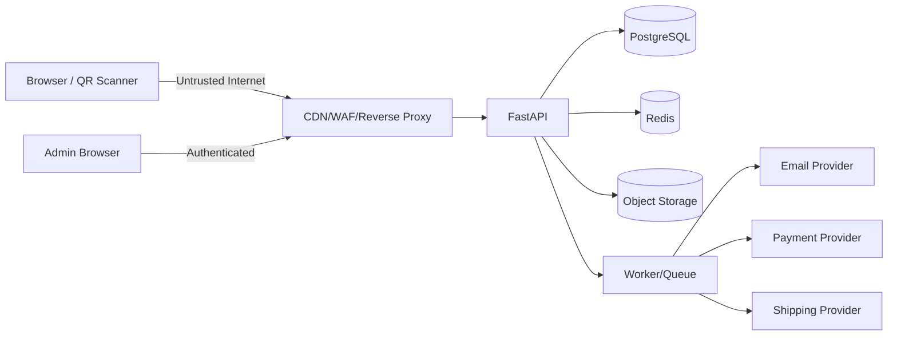

# 07. Security, Privacy and Compliance

## 1. Trạng thái tài liệu

- `CURRENT`: CORS allowlist, sanitize text cơ bản, honeypot, rate limit in-memory, QR destination nội bộ.
- `NEXT`: secret management, PostgreSQL persistence, structured logging, dependency scanning, admin authentication, Redis rate limit và security headers.
- `TARGET`: threat model đầy đủ, RBAC/MFA, audit, privacy request, retention, incident response, provider security và kiểm thử định kỳ.

Tài liệu này là baseline kỹ thuật, không thay thế tư vấn pháp lý. Trước khi thu thập dữ liệu khách hàng thật, nhận thanh toán hoặc mở rộng vận hành, dự án phải rà soát yêu cầu pháp lý áp dụng với đơn vị phụ trách.

## 2. Security objectives

1. Bảo mật dữ liệu cá nhân và dữ liệu vận hành.
2. Bảo toàn nội dung, QR registry, giá, tồn kho, đơn hàng và thanh toán.
3. Duy trì khả dụng của website/API.
4. Truy vết được hành động quản trị quan trọng.
5. Giảm blast radius khi credential hoặc provider bị compromise.
6. Không tuyên bố mức bảo mật/truy xuất/chống giả vượt quá khả năng thật.

## 3. Asset inventory

### 3.1. Critical assets

- Secret ký session/JWT.
- Database credential.
- Admin account và MFA recovery.
- Payment webhook secret/API credential.
- Object storage credential.
- Email provider credential.
- Order/payment/refund state.
- Role/permission assignment.
- Audit log.

### 3.2. Sensitive assets

- Tên, email, số điện thoại.
- Địa chỉ giao hàng.
- Nội dung contact/partner/feedback có thể chứa thông tin cá nhân.
- Consent record.
- Customer account/session.
- Export CSV chứa PII.
- Internal note về lead/order.

### 3.3. Public but integrity-sensitive assets

- Nội dung văn hóa.
- Hướng dẫn pha.
- Product/catalog/price.
- QR destination và content version.
- Journal/policy/SEO.

## 4. Data classification

| Class | Ví dụ | Xử lý |
| --- | --- | --- |
| Public | Product, journal đã publish, ảnh public | Có thể cache/CDN |
| Internal | Draft content, roadmap, aggregate nội bộ | Auth + least privilege |
| Confidential | Submission, customer profile, address, order | Encryption in transit/at rest, access control, no shared cache |
| Restricted | Secret, password hash, token hash, webhook key, refund control | Secret manager/strong controls, audit, không export tùy ý |

Mỗi field mới phải xác định class trước khi lưu.

## 5. Threat model cấp cao

### 5.1. External attacker

Mục tiêu có thể gồm:

- Spam form.
- Credential stuffing.
- Chiếm admin account.
- Truy cập submission/order người khác.
- Open redirect/phishing qua QR.
- Injection/XSS qua content/form.
- Upload file độc hại.
- DDoS/abuse analytics.
- Giả webhook thanh toán.

### 5.2. Malicious/compromised insider

- Export PII diện rộng.
- Sửa giá/nội dung/QR trái phép.
- Điều chỉnh tồn kho.
- Refund gian lận.
- Cấp quyền cao hơn.
- Xóa dấu vết.

### 5.3. Accidental operator error

- Publish nội dung chưa duyệt.
- Active QR trỏ sai content version.
- Xóa/ghi đè dữ liệu.
- Deploy migration lỗi.
- Lộ secret qua log/commit.

### 5.4. Provider compromise/failure

- Email gửi sai/ngừng hoạt động.
- Storage lộ file private.
- Payment webhook giả/replay.
- Shipping status sai.
- CDN/cache phục vụ nội dung cũ.

## 6. Trust boundaries



Mọi dữ liệu đi qua trust boundary phải validate và authenticate/authorize theo ngữ cảnh.

## 7. Secure development baseline

- Code review cho mutation/security-sensitive change.
- Branch protection khi repository ổn định.
- CI lint, test, secret scan, dependency scan.
- Không commit `.env`, private key hoặc token.
- Dependency pin/lock và update có kiểm thử.
- Security issue có quy trình ưu tiên riêng.
- Không tắt kiểm tra bảo mật chỉ để pipeline xanh mà không ghi risk acceptance.

## 8. Transport security

Production:

- HTTPS bắt buộc.
- Redirect HTTP -> HTTPS ở edge.
- TLS do nền tảng được duy trì.
- Cookie `Secure`.
- HSTS sau khi xác nhận toàn bộ subdomain phù hợp.
- Không mixed content.

Internal connection:

- Dùng TLS đến managed DB/cache khi nền tảng hỗ trợ/yêu cầu.
- Không mở DB/Redis công khai Internet.

## 9. Security headers

Baseline ở edge/app:

```text
Strict-Transport-Security: max-age=31536000; includeSubDomains
X-Content-Type-Options: nosniff
Referrer-Policy: strict-origin-when-cross-origin
Permissions-Policy: camera=(), microphone=(), geolocation=()
Content-Security-Policy: ...
```

Lưu ý:

- CSP phải thiết kế theo tài nguyên frontend thật, không copy policy khiến site hỏng.
- `frame-ancestors` dùng để chống clickjacking.
- Không phụ thuộc `X-XSS-Protection` cũ.

## 10. CORS and browser boundary

- Origin allowlist chính xác.
- Không dùng wildcard với credential.
- CORS không thay authorization.
- Validate CSRF nếu dùng cookie auth.
- Không expose header nhạy cảm không cần thiết.
- Preflight được test trên staging/production domain thật.

## 11. Injection prevention

### SQL

- Dùng ORM/query parameterization.
- Không nối chuỗi SQL từ query/filter/sort client.
- Sort/filter dùng allowlist.
- Raw SQL phải parameterized và review.

### Command/template

- Không truyền input vào shell command.
- Nếu bắt buộc, dùng argument list và allowlist.
- Template email/server-side escape variable mặc định.

### JSON/NoSQL-like query

- Không cho client gửi expression/query object tùy ý để map trực tiếp vào ORM.

## 12. XSS and content safety

- API sanitize cơ bản không thay output encoding.
- Plain text render như text, không dùng `dangerouslySetInnerHTML` tùy ý.
- Rich text dùng schema block hoặc HTML sanitizer allowlist.
- URL trong content validate scheme/domain.
- Media alt/caption cũng là untrusted text nếu do admin nhập.
- Preview admin không được bypass sanitizer production.

## 13. QR security

Controls bắt buộc:

1. Normalize code.
2. Registry server-side.
3. Destination allowlist nội bộ.
4. Không lấy destination từ query/client.
5. Không redirect URL tuyệt đối ngoài allowlist.
6. QR inactive/revoked giữ record và hiển thị trạng thái an toàn.
7. Content version phải publish trước activation.
8. Scan analytics không chứa PII.
9. Rate limit scan endpoint.
10. Alert khi destination invalid hoặc scan anomaly lớn.

Không tuyên bố QR là chống hàng giả nếu chỉ là mã theo dòng/lô và có thể sao chép.

## 14. Form and anti-abuse security

Hiện có honeypot `website`. Production nên kết hợp:

- Rate limit.
- Minimum form-fill time nếu phù hợp.
- Duplicate detection mềm.
- Content length limit.
- Blocklist/score có kiểm soát.
- CAPTCHA/challenge chỉ khi abuse thực tế tăng.
- Email verification cho use case cần xác nhận.

Không tự động xóa submission chỉ vì heuristic không chắc chắn; chuyển spam review nếu cần.

## 15. Authentication security

- Password hash Argon2id/bcrypt cấu hình phù hợp.
- Generic login/reset response chống enumeration.
- Rate limit theo IP + account key.
- Session revoke/expiry.
- Refresh rotation nếu dùng token.
- HttpOnly Secure cookie.
- MFA/step-up cho admin nhạy cảm.
- Không log password/token/OTP.
- Security notification cho thay đổi quan trọng.

Chi tiết tại `05-authentication-authorization.md`.

## 16. Authorization security

- Deny by default.
- Backend enforce permission.
- Kiểm tra ownership/scope.
- Permission tách theo action nhạy cảm.
- Export/refund/RBAC có permission riêng.
- Không dùng role name client gửi làm nguồn quyền.
- Không tin hidden UI.
- Test horizontal và vertical privilege escalation.

## 17. Mass assignment protection

Request schema riêng cho từng action.

Không dùng model database làm request body trực tiếp.

Ví dụ customer profile PATCH không được nhận:

- `role`.
- `status`.
- `email_verified_at`.
- `created_at`.
- `is_admin`.

Admin endpoint vẫn dùng field allowlist và permission.

## 18. Object-level authorization

Mọi endpoint theo ID phải kiểm tra:

1. Resource tồn tại.
2. Actor có quyền loại resource.
3. Actor sở hữu/thuộc scope nếu áp dụng.
4. Resource state cho phép action.

Để giảm enumeration, resource ngoài scope có thể trả `404` thay vì `403`.

## 19. File upload security

- Permission trước upload intent.
- Random storage key.
- Size limit.
- MIME/extension/magic-byte validation.
- Image decode/re-encode hoặc malware scan theo rủi ro.
- Quarantine trước `ready`.
- Private bucket mặc định cho file nhạy cảm.
- Signed URL ngắn hạn.
- Không cho upload SVG/HTML public nếu chưa có sanitizer/chính sách rõ.
- Không thực thi file upload.

## 20. Object storage security

- Bucket private mặc định, public qua CDN/policy chọn lọc.
- Block public access ngoài asset public đã kiểm soát.
- Credential scope tối thiểu.
- Versioning/lifecycle cho asset quan trọng.
- Presigned URL thời hạn ngắn.
- Không log full signed URL.
- Tách bucket/prefix theo environment.

## 21. Secret management

Secret gồm:

- DB URL/password.
- Session/JWT signing key.
- Email API key.
- Storage key.
- Payment/shipping credential.
- Webhook secret.
- Hashing pepper/salt secret nếu dùng.

Rules:

1. Production secret nằm trong secret manager/platform secret.
2. Không commit, không hard-code.
3. Quyền đọc theo service/environment.
4. Rotate định kỳ hoặc khi nghi compromise.
5. Có runbook rotation không downtime nếu khả thi.
6. Key có version/kid khi cần.
7. Secret scan trong pre-commit/CI.

## 22. Logging security

Không log:

- Password.
- Access/refresh/reset/verification token.
- Cookie/Authorization header.
- Full payment payload.
- Card data/CVV.
- Raw submission payload.
- Full address/phone/email khi không cần.
- Presigned URL đầy đủ.

Có thể log:

- Request ID.
- Actor ID nội bộ.
- Route template.
- Status code.
- Duration.
- Error code.
- Provider event ID.
- Resource ID.

PII masking:

```text
a***@example.com
***6789
```

Chỉ dùng khi có mục đích vận hành rõ.

## 23. Audit log security

- Append-only ở application layer.
- Quyền đọc hạn chế.
- Không cho generic update/delete.
- Ghi actor, target, action, before/after summary, request ID, timestamp.
- Không ghi secret/credential.
- Export audit cũng được audit.
- Retention dài hơn application log theo chính sách.

## 24. Payment security

Chỉ khi Transactional Mode bật:

1. Dùng hosted checkout/tokenization của provider nếu có.
2. Không lưu card number/CVV.
3. Server tính order amount.
4. Verify webhook signature từ raw body.
5. Deduplicate event.
6. Không đánh dấu paid chỉ từ return URL client.
7. Refund cần permission, reason, idempotency và audit.
8. Reconciliation định kỳ giữa local và provider.
9. Sandbox/production credential tách tuyệt đối.

## 25. Webhook security

- HTTPS.
- Signature verification.
- Timestamp tolerance/replay protection nếu provider hỗ trợ.
- Event ID unique.
- Rate limit hợp lý nhưng không làm mất event hợp lệ.
- Raw body được đọc đúng trước JSON parse nếu thuật toán yêu cầu.
- Trả response nhanh sau khi ghi nhận bền vững.
- Retry idempotent.
- Không allowlist IP như biện pháp duy nhất nếu provider không cam kết IP ổn định.

## 26. Database security

- Database không public Internet.
- TLS nếu hỗ trợ.
- App user có quyền tối thiểu, không superuser.
- Migration credential có thể tách khỏi runtime credential.
- Backup mã hóa.
- Không dùng production credential ở local/CI.
- Query timeout/pool limit.
- RLS chỉ dùng khi có use case và đội hiểu rõ; không thay service authorization một cách tùy tiện.

## 27. Redis security

- Không public Internet.
- TLS/auth theo provider.
- Key prefix theo environment.
- Không lưu PII/secret thô nếu không cần.
- TTL bắt buộc cho cache/rate limit/session tùy use case.
- Redis không là nguồn sự thật duy nhất cho order/payment.

## 28. Dependency and supply-chain security

- Pin/lock dependency.
- Automated vulnerability scan.
- Review package maintainer/popularity/license trước khi thêm.
- Không chạy script không tin cậy trong CI với secret production.
- GitHub Actions pin action version/SHA theo mức phù hợp.
- Dependabot/Renovate update qua PR và test.
- Generate SBOM nếu dự án tiến đến production nghiêm túc.

## 29. CI/CD security

- Protected environment cho production.
- Secret chỉ cấp job cần thiết.
- PR từ fork không nhận production secret.
- Build artifact bất biến.
- Deploy theo commit SHA.
- Migration có approval/backup/rollback plan.
- Không in secret vào log.
- OIDC/workload identity ưu tiên hơn long-lived cloud key nếu nền tảng hỗ trợ.

## 30. Privacy principles

1. Purpose limitation: chỉ thu dữ liệu cho mục đích đã nêu.
2. Data minimization: không hỏi/lưu field không cần.
3. Transparency: thông báo rõ dữ liệu dùng thế nào.
4. Consent specificity: marketing khác follow-up/research/terms.
5. Accuracy: có cơ chế sửa dữ liệu phù hợp.
6. Retention: không giữ vô hạn theo mặc định.
7. Access control: chỉ người cần mới xem.
8. Security: bảo vệ trong truyền/lưu/xử lý.
9. Accountability: có owner, audit và quy trình xử lý yêu cầu.

## 31. PII inventory

| Domain | PII có thể có | Mục đích |
| --- | --- | --- |
| Submission | tên, email, phone, organization, message | phản hồi/liên hệ/đặt trước |
| Account | email, profile, session metadata | xác thực và tài khoản |
| Address | người nhận, phone, địa chỉ | giao hàng |
| Order | email, address snapshot, lịch sử mua | thực hiện đơn |
| Consent | subject reference, purpose, timestamps | bằng chứng/quản lý đồng ý |
| Support note | nội dung vận hành | hỗ trợ khách hàng |
| Analytics | nên không có PII trực tiếp | đo trải nghiệm |

Mỗi field mới cần cập nhật data inventory.

## 32. Consent management

Consent record tối thiểu:

- Subject/user/submission reference.
- Purpose.
- Granted/withdrawn.
- Policy/notice version.
- Source.
- Timestamp.
- Evidence tối thiểu.

Rules:

- Không pre-check marketing consent.
- Không gộp consent không cần thiết với terms bắt buộc.
- Withdrawal dễ thực hiện tương ứng.
- Rút consent chặn xử lý tương lai theo purpose đó.
- Không xóa bằng chứng consent/rút consent ngay nếu cần accountability.

## 33. Privacy request workflow

Loại:

- Access.
- Export.
- Correction.
- Deletion/anonymization.
- Consent withdrawal.

Luồng:

```text
received -> identity_verification -> in_review -> fulfilled/rejected -> closed
```

Rules:

- Xác minh danh tính trước khi trả/xóa dữ liệu.
- Không gửi export PII đến email chưa xác minh.
- Deletion kiểm tra nghĩa vụ giữ order/payment/audit.
- Ưu tiên anonymization khi cần giữ tính toàn vẹn lịch sử.
- Ghi audit và thời hạn xử lý theo chính sách/pháp lý đã được duyệt.

## 34. Data retention

Chính sách cụ thể cần owner/pháp lý phê duyệt. Baseline kỹ thuật:

- Token hết hạn: cleanup định kỳ.
- Session revoked/expired: giữ ngắn cho security investigation rồi xóa.
- Raw analytics: retention ngắn; aggregate dài hơn.
- Submission spam: xóa sớm hơn nếu không cần.
- Submission hợp lệ: giữ theo vòng đời lead + thời hạn đã duyệt.
- Order/payment: giữ theo nhu cầu vận hành/kế toán/pháp lý áp dụng.
- Audit: giữ lâu hơn app log.
- Backup: retention riêng và phải bao phủ deletion cycle hợp lý.

Không ghi con số retention giả định vào privacy notice production nếu chưa được phê duyệt.

## 35. Data anonymization

Khi không thể xóa record do ràng buộc lịch sử:

- Thay tên bằng giá trị ẩn danh.
- Xóa/replace email, phone, address.
- Xóa free-text chứa PII sau review nếu phù hợp.
- Giữ amount/status/order item cần thiết.
- Không giữ mapping có thể đảo ngược nếu mục tiêu là anonymization thật.

Hash dữ liệu không tự động trở thành anonymous nếu vẫn có thể liên kết lại.

## 36. Analytics privacy

Public analytics event không nhận:

- Name.
- Email.
- Phone.
- Address.
- Full form message.
- Payment data.

`properties` dùng allowlist.

Referrer:

- Ưu tiên chỉ lưu host/path cần thiết.
- Bỏ query string có thể chứa token/PII.

IP:

- Không lưu thô dài hạn.
- Nếu cần abuse detection, hash với secret/salt xoay vòng và retention ngắn.

## 37. Data export security

- Permission riêng.
- Filter/field scope rõ.
- Export lớn qua background job.
- File private.
- Signed URL có hạn.
- Mã hóa storage.
- Audit actor, filter, số record, timestamp.
- Tự động xóa file export sau thời hạn ngắn.
- Không gửi file PII như attachment email không kiểm soát.

## 38. Backup privacy

- Backup được mã hóa.
- Quyền truy cập hạn chế.
- Có retention.
- Deletion request có tài liệu về việc dữ liệu có thể tồn tại trong backup cho đến vòng quay nhưng không được restore vào vận hành thường mà không áp dụng lại deletion log.
- Restore test dùng môi trường kiểm soát.

## 39. Vulnerability handling

Quy trình:

1. Tiếp nhận/phát hiện.
2. Triage severity và affected asset.
3. Containment.
4. Patch/mitigation.
5. Test.
6. Deploy.
7. Rotate secret/revoke session nếu cần.
8. Review log/audit.
9. Post-incident action.

Không công khai chi tiết khai thác trước khi khắc phục nếu gây rủi ro cho người dùng.

## 40. Incident response

### 40.1. Severity gợi ý

| Severity | Ví dụ |
| --- | --- |
| SEV-1 | Lộ secret production, chiếm admin, payment integrity bị ảnh hưởng, dữ liệu PII diện rộng |
| SEV-2 | API quan trọng down, unauthorized access giới hạn, mất dữ liệu có thể phục hồi |
| SEV-3 | Abuse/spam tăng, lỗi tính năng không ảnh hưởng dữ liệu quan trọng |
| SEV-4 | Issue thấp, hardening/backlog |

### 40.2. Runbook tối thiểu

- Ai là incident lead.
- Kênh liên lạc nội bộ.
- Cách khóa deploy/feature.
- Cách revoke session/API key.
- Cách rotate secret.
- Cách disable payment/checkout/QR content nguy hiểm.
- Cách lấy log/audit có kiểm soát.
- Cách restore.
- Cách ghi timeline và quyết định.

## 41. Security monitoring

Alert candidate:

- Login admin thất bại tăng mạnh.
- Role/permission thay đổi.
- Export PII lớn.
- Refund bất thường.
- QR destination invalid.
- Webhook signature invalid tăng.
- Rate limit spike.
- 5xx tăng.
- DB connection failure.
- Secret scan finding.
- Audit pipeline failure.

Alert phải có owner và runbook; không tạo alert không ai xử lý.

## 42. Security test checklist

### Public API

- Injection payload.
- Oversized payload.
- Invalid content type.
- Rate limit.
- CORS.
- QR open redirect.
- QR status leakage.
- Form spam/honeypot.
- Analytics PII rejection.

### Auth/account

- Enumeration.
- Brute force.
- Session fixation/reuse.
- CSRF.
- Token expiry/revocation.
- Reset token single-use.
- Horizontal access to order/address.

### Admin

- Missing permission.
- Privilege escalation.
- Mass assignment.
- Export without permission.
- Publish/refund/inventory/RBAC audit.
- Stored XSS in content/admin table.

### Payment/webhook

- Invalid signature.
- Replay event.
- Duplicate event.
- Amount mismatch.
- Client return forged.
- Refund over captured amount.

### Upload

- MIME spoof.
- Oversized image.
- SVG/HTML active content.
- Path traversal filename.
- Private file public access.

## 43. Security release gate

Trước production:

- [ ] HTTPS và cookie flag đúng.
- [ ] CORS/trusted host đúng domain.
- [ ] Secret không ở repo/log.
- [ ] Admin auth + RBAC + audit.
- [ ] Database/Redis không public.
- [ ] Backup + restore test.
- [ ] Rate limit distributed.
- [ ] Error không lộ stack/SQL/secret.
- [ ] Dependency/secret scan sạch hoặc risk accepted.
- [ ] Privacy notice/consent/retention đã được owner duyệt.
- [ ] Incident contact/runbook có sẵn.
- [ ] Payment webhook verification nếu bật payment.
- [ ] Upload private/public policy đã test.

## 44. Definition of Done

Một feature xử lý dữ liệu thật chỉ hoàn thành khi:

- Có data classification và purpose.
- Có validation/auth/authorization.
- Có encryption transport/storage phù hợp.
- Có logging an toàn.
- Có retention/deletion behavior.
- Có audit nếu là admin action nhạy cảm.
- Có abuse/rate-limit control nếu public.
- Có test negative/security path.
- Có incident/degraded behavior.
- Không tuyên bố khả năng vượt quá implementation thật.
