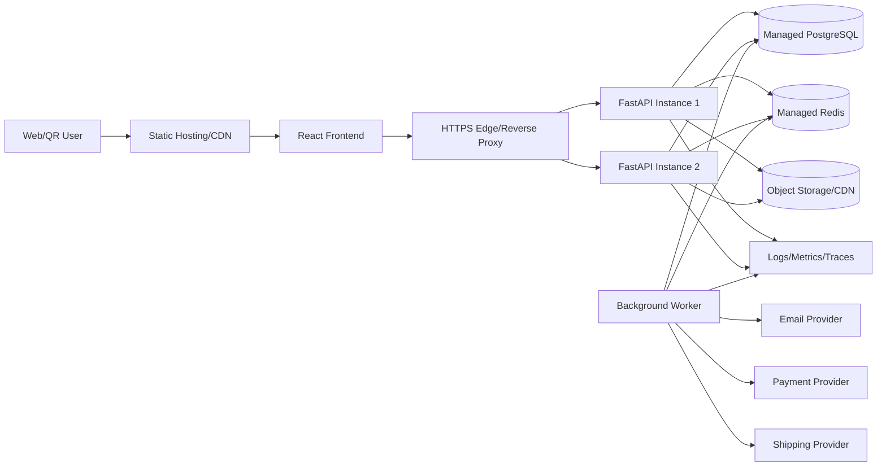

# 09. Deployment, Observability and Operations

## 1. Trạng thái tài liệu

- `CURRENT`: FastAPI chạy bằng Uvicorn; Docker Compose có frontend/backend; chưa có database production, migration pipeline, worker hoặc observability đầy đủ.
- `NEXT`: container production, PostgreSQL, Alembic, structured logging, readiness, CI/CD và backup.
- `TARGET`: Redis, worker/outbox, metrics/traces, alerting, zero/low-downtime rollout, provider runbook và disaster recovery.

## 2. Mục tiêu vận hành

1. Deploy lặp lại được theo commit/artifact.
2. Không mất dữ liệu khi restart/scale-out.
3. Phát hiện lỗi trước khi người dùng báo.
4. Có khả năng rollback/forward-fix.
5. Backup có thể restore.
6. Secret và production access được kiểm soát.
7. Có runbook cho sự cố thường gặp.

## 3. Kiến trúc triển khai mục tiêu



MVP có thể chạy một API instance, nhưng dữ liệu nghiệp vụ vẫn phải ở PostgreSQL, không ở memory process.

## 4. Deployment units

| Unit | Nội dung | Scale |
| --- | --- | --- |
| Frontend | Static React build | CDN/static hosting |
| API | FastAPI app | horizontal khi cần |
| Worker | Background jobs/outbox consumer | independent |
| Scheduler | Job định kỳ | singleton/managed scheduler |
| Database | PostgreSQL | managed ưu tiên |
| Cache/queue | Redis | optional ở NEXT, cần cho distributed capability |
| Object storage | Media/export | managed |

Không nhúng scheduler giống cron vào mọi API worker nếu có thể làm job chạy lặp.

## 5. Container image

### 5.1. Nguyên tắc

- Base image cụ thể, không dùng `latest`.
- Multi-stage khi cần.
- Chạy non-root.
- Không copy `.env`, test secret hoặc cache không cần.
- Dependency được lock/pin.
- Healthcheck phù hợp.
- Image immutable theo commit SHA.
- Scan vulnerability.

### 5.2. Dockerfile định hướng

```dockerfile
FROM python:3.12-slim AS runtime

ENV PYTHONDONTWRITEBYTECODE=1 \
    PYTHONUNBUFFERED=1

WORKDIR /app

RUN addgroup --system app && adduser --system --ingroup app app

COPY requirements.txt ./
RUN pip install --no-cache-dir -r requirements.txt

COPY app ./app

USER app
EXPOSE 8000

CMD ["uvicorn", "app.main:app", "--host", "0.0.0.0", "--port", "8000"]
```

Production có thể dùng Gunicorn/Uvicorn worker hoặc platform process model; cần benchmark và tránh nhân worker quá mức so với DB pool.

## 6. Runtime process model

### Local

```bash
uvicorn app.main:app --reload --host 0.0.0.0 --port 8000
```

### Production

- Không dùng `--reload`.
- Số worker dựa trên CPU, I/O và DB pool.
- Timeout/keep-alive do edge và app phối hợp.
- Graceful shutdown đủ thời gian hoàn tất request ngắn.
- Worker job có shutdown/visibility timeout rõ.

## 7. Environment variables

### Core

```text
APP_ENV=production
API_PREFIX=/api/v1
APP_VERSION=<commit-sha-or-release>
LOG_LEVEL=INFO
FRONTEND_ORIGINS=https://senova.example
TRUSTED_HOSTS=api.senova.example
```

### Database

```text
DATABASE_URL=postgresql+psycopg://...
DB_POOL_SIZE=10
DB_MAX_OVERFLOW=10
DB_POOL_TIMEOUT_SECONDS=30
DB_STATEMENT_TIMEOUT_MS=10000
```

### Redis

```text
REDIS_URL=rediss://...
CACHE_DEFAULT_TTL_SECONDS=300
```

### Auth/security

```text
SESSION_SIGNING_KEY=<secret>
ACCESS_TOKEN_TTL_MINUTES=15
REFRESH_TOKEN_TTL_DAYS=30
CSRF_SECRET=<secret>
```

### Providers

```text
EMAIL_PROVIDER=...
EMAIL_API_KEY=<secret>
STORAGE_BUCKET=...
STORAGE_REGION=...
PAYMENT_PROVIDER=disabled
PAYMENT_WEBHOOK_SECRET=<secret>
SHIPPING_PROVIDER=disabled
```

### Rate limits

```text
SUBMISSION_RATE_LIMIT_PER_MINUTE=10
QR_SCAN_RATE_LIMIT_PER_MINUTE=60
ANALYTICS_RATE_LIMIT_PER_MINUTE=120
```

Không đưa secret value vào file tài liệu thật hoặc output debug.

## 8. Configuration validation

Startup phải fail khi:

- Production thiếu database URL.
- Production dùng wildcard CORS với credential.
- Auth bật nhưng thiếu signing/session key.
- Payment bật nhưng thiếu webhook secret.
- Storage upload bật nhưng thiếu bucket/credential.
- Secret có placeholder mặc định.

Startup warning/degraded khi:

- Redis optional không có và app có fallback.
- Email provider disabled trong local/staging.

## 9. Database deployment

### 9.1. Migration sequence

Khuyến nghị:

```text
Build artifact
-> backup/checkpoint nếu cần
-> run Alembic migration job
-> verify migration
-> deploy API/worker
-> smoke test
```

Không để mọi API instance tự chạy migration đồng thời khi startup.

### 9.2. Migration categories

| Loại | Rủi ro | Cách triển khai |
| --- | --- | --- |
| Add nullable column/index | thấp-trung bình | expand |
| Add NOT NULL | trung bình | backfill trước |
| Rename/drop column | cao | expand/contract nhiều release |
| Large index | cao | concurrent/online nếu PostgreSQL hỗ trợ |
| Data backfill lớn | cao | job batch, resumable |
| Enum/state change | trung bình-cao | tương thích code cũ/mới |

### 9.3. Pre-migration checklist

- [ ] Backup/PITR sẵn sàng.
- [ ] Dung lượng đủ.
- [ ] Estimate lock/duration.
- [ ] Code cũ tương thích schema mới.
- [ ] Backfill plan.
- [ ] Rollback/forward-fix plan.
- [ ] Monitoring trong migration.

## 10. Release strategy

### 10.1. Small project baseline

- Deploy staging.
- Run migration.
- Smoke test.
- Manual approval production.
- Deploy production.
- Smoke test/monitor.

### 10.2. Rolling deployment

Yêu cầu:

- Schema backward-compatible trong cửa sổ rollout.
- Readiness chỉ true khi instance sẵn sàng.
- Graceful shutdown.
- Session không phụ thuộc memory instance.
- Rate limit/cache distributed nếu nhiều instance.

### 10.3. Blue/green/canary — optional

Dùng khi traffic/rủi ro đủ lớn. Không thêm độ phức tạp nếu chưa có khả năng quan sát và rollback.

## 11. Feature flag rollout

Dùng flag cho:

- API v1 migration.
- Product API thay hardcoded data.
- Database-backed submission.
- Admin modules.
- Account.
- Transactional checkout.
- Payment/shipping provider.

Rollout mẫu:

```text
off -> internal -> staging -> small percentage/selected users -> all
```

Mỗi flag có owner và ngày xóa; không giữ flag vĩnh viễn không ai quản lý.

## 12. CI/CD pipeline

### Pull request

1. Install locked dependencies.
2. Format/lint.
3. Type check.
4. Unit test.
5. PostgreSQL/Redis integration test.
6. Alembic upgrade test.
7. OpenAPI generation/diff.
8. Dependency/secret/security scan.
9. Build image.

### Main/release

1. Build image một lần.
2. Tag commit SHA và release tag.
3. Push registry.
4. Deploy staging cùng artifact.
5. Smoke/E2E.
6. Approval.
7. Migration production.
8. Deploy cùng artifact.
9. Post-deploy check.
10. Record deployment metadata.

Không rebuild code khác nhau giữa staging và production.

## 13. Branch and environment protection

- Main branch cần PR/review khi đội ổn định.
- Required CI checks.
- Production environment cần approval.
- Chỉ deploy từ protected branch/tag.
- Secret production chỉ trong protected environment.
- GitHub Actions từ fork không nhận production secret.

## 14. Health checks

### Liveness

```http
GET /api/v1/health/live
```

Chỉ trả app process còn hoạt động; không phụ thuộc mọi provider.

### Readiness

```http
GET /api/v1/health/ready
```

Kiểm tra dependency bắt buộc:

- Database.
- Migration compatibility nếu có.
- Redis nếu feature bắt buộc.

Không kiểm tra provider chậm bằng request blocking dài.

### Startup

Nếu platform hỗ trợ, startup probe cho thời gian load/migration verification.

## 15. Structured logging

### 15.1. Format

Production ưu tiên JSON:

```json
{
  "timestamp": "2026-07-13T15:30:00Z",
  "level": "INFO",
  "service": "senova-api",
  "environment": "production",
  "version": "5392fb2",
  "requestId": "req_...",
  "method": "POST",
  "route": "/api/v1/submissions",
  "statusCode": 201,
  "durationMs": 42,
  "errorCode": null
}
```

### 15.2. Fields

- timestamp.
- level.
- service/environment/version.
- request/correlation ID.
- route template, không phải raw path nhạy cảm khi có token.
- method/status/duration.
- actor ID nội bộ nếu có.
- error code.
- provider event/job ID khi phù hợp.

### 15.3. Redaction

Redact:

- Authorization/cookie.
- Token/OTP.
- Password.
- Raw form payload.
- Email/phone/address đầy đủ.
- Payment credential.
- Signed URL.

## 16. Log levels

| Level | Dùng cho |
| --- | --- |
| DEBUG | local/staging chẩn đoán, không chứa secret |
| INFO | lifecycle/request summary/business event an toàn |
| WARNING | retry, degraded dependency, rate-limit spike |
| ERROR | request/job thất bại cần điều tra |
| CRITICAL | integrity/security/availability nghiêm trọng |

Không log mọi request body ở DEBUG production.

## 17. Metrics

### 17.1. HTTP

- `http_requests_total{method,route,status}`.
- `http_request_duration_seconds{route}` histogram.
- `http_in_flight_requests`.

### 17.2. Database

- Connection pool in-use/wait.
- Query duration/error.
- Transaction rollback.
- Deadlock/lock wait.

### 17.3. Domain

QR:

- `qr_resolve_total{status,product}`.
- `qr_scan_total{status,product}`.
- `qr_content_not_found_total`.

Submission:

- `submission_created_total{kind}`.
- `submission_rejected_total{reason}`.
- `submission_backlog{status}`.

Commerce:

- `order_created_total`.
- `order_transition_total{from,to}`.
- `checkout_failure_total{reason}`.
- `inventory_reservation_failure_total`.
- `payment_event_total{type,status}`.
- `refund_total{status}`.

Jobs:

- Queue depth.
- Oldest pending age.
- Processing duration.
- Retry/dead-letter count.

### 17.4. Privacy

Không dùng email/phone/order ID làm metric label vì cardinality và privacy.

## 18. Tracing

`TARGET` khi hệ thống có worker/provider hoặc cần chẩn đoán sâu.

Span:

- HTTP request.
- Service operation.
- DB query summary.
- Redis.
- Outbound provider call.
- Worker job.

Propagate correlation context qua outbox/job.

Không đưa PII/secret vào span attribute.

## 19. Dashboards

### API dashboard

- Request rate.
- Error rate.
- p50/p95/p99 latency.
- Top failing route.
- Instance CPU/memory/restart.

### Database dashboard

- Connections.
- Slow query.
- Lock/deadlock.
- Storage/replication/backup.

### QR/submission dashboard

- Resolve/scan theo status/product.
- Invalid/inactive QR.
- Submission theo kind/status.
- Spam/rate-limited.
- Lead backlog/age.

### Commerce dashboard

- Cart/order conversion.
- Order state.
- Payment failure.
- Inventory low/reservation failure.
- Refund/shipment issues.

## 20. Alerting principles

Mỗi alert phải có:

- Mức độ.
- Owner.
- Runbook link.
- Ngưỡng/cửa sổ.
- Cách xác nhận và giảm tác động.

Tránh alert theo một lỗi đơn lẻ không quan trọng; dùng rate/burn-rate khi có SLO.

## 21. Alert candidates

### Availability

- API 5xx rate cao.
- Readiness fail nhiều instance.
- DB unavailable.
- Queue backlog tăng liên tục.

### Integrity

- Migration fail.
- Payment amount mismatch.
- Duplicate provider event bất thường.
- Inventory invariant fail.
- Audit write fail.

### Security

- Admin login failure spike.
- Role/permission changes.
- Export PII lớn.
- Refund spike.
- Webhook signature invalid spike.
- QR destination invalid.

### Capacity

- DB connection saturation.
- Disk/storage gần đầy.
- Memory/restart loop.
- Redis memory/eviction bất thường.

## 22. SLI/SLO định hướng

Chưa nên công bố cam kết khi chưa đo baseline. Sau khi production có dữ liệu, xác định:

- API availability.
- Public GET/QR latency.
- Submission successful persistence rate.
- Payment webhook processing latency.
- Queue age.
- Backup success/restore objective.

SLO phải loại trừ/định nghĩa maintenance và dependency external rõ.

## 23. Backup strategy

### Database

- Managed automated backup.
- Point-in-time recovery nếu có.
- Retention phù hợp.
- Encryption.
- Cross-region/cross-account nếu mức rủi ro yêu cầu.

### Object storage

- Versioning cho asset quan trọng.
- Lifecycle cho export/temp file.
- Backup/replication theo nhu cầu.

### Configuration

- Infrastructure/config as code.
- Secret không backup vào repo.
- Danh sách integration/config version được lưu an toàn.

## 24. Restore testing

Ít nhất định kỳ:

1. Tạo môi trường cô lập.
2. Restore database backup.
3. Chạy migration cần thiết.
4. Kiểm tra row count/invariant.
5. Chạy smoke API.
6. Kiểm tra object references.
7. Ghi thời gian và vấn đề.

Backup chưa từng restore test không đủ bằng chứng phục hồi.

## 25. Recovery objectives

RTO/RPO phải do owner chốt dựa trên tác động và chi phí.

Ví dụ khái niệm:

- RPO: mức mất dữ liệu tối đa chấp nhận.
- RTO: thời gian phục hồi tối đa chấp nhận.

Không tự ghi số cam kết nếu chưa có hạ tầng và kiểm thử tương ứng.

## 26. Runbook: API 5xx tăng

1. Xác nhận phạm vi route/version/instance.
2. Kiểm tra deploy gần nhất.
3. Kiểm tra DB/Redis/provider.
4. Tra log theo request ID/error code.
5. Nếu do release mới, cân nhắc rollback/disable flag.
6. Nếu do provider, bật degraded mode/queue.
7. Theo dõi error rate sau mitigation.
8. Ghi incident timeline và regression test.

## 27. Runbook: Database unavailable

1. Xác nhận provider status/network/credential.
2. Kiểm tra connection pool và max connections.
3. Không tự động retry vô hạn ở API.
4. Readiness fail để ngừng route traffic nếu cần.
5. Bảo vệ mutation khỏi trả success giả.
6. Khi DB hồi phục, kiểm tra queue/outbox và invariant.
7. Không restore backup trước khi xác định nguyên nhân.

## 28. Runbook: Submission không lưu

1. Kiểm tra API error/DB.
2. Xác nhận frontend không đang fallback localStorage trong production mà không thông báo.
3. Kiểm tra rate limit/validation/spam.
4. Kiểm tra transaction và table growth.
5. Khôi phục service.
6. Nếu có queue/buffer, replay idempotently.
7. Không hứa đã nhận dữ liệu nếu backend chưa persist.

## 29. Runbook: QR lỗi

### QR not found spike

- Kiểm tra code in/URL encode/case.
- Kiểm tra seed/migration/import.
- Kiểm tra campaign mới.
- Không tự alias code sai mà không có record/audit.

### Destination invalid

- Xem là lỗi cấu hình/security.
- Pause QR record liên quan nếu cần.
- Sửa registry qua admin/migration có audit.
- Không lấy destination từ client để “khắc phục nhanh”.

### Content not found

- Kiểm tra version/locale/publish state/batch override.
- Không tự trả nội dung draft.

## 30. Runbook: Payment webhook lỗi

1. Kiểm tra signature failure và provider status.
2. Không đánh dấu paid thủ công chỉ từ ảnh/return URL.
3. Tra provider event ID/payment reference.
4. Re-fetch status từ provider bằng authenticated server API nếu quy trình cho phép.
5. Replay event idempotently.
6. Đối soát order/payment/inventory.
7. Audit mọi chỉnh sửa thủ công.

## 31. Runbook: Queue backlog

1. Kiểm tra worker alive/restart.
2. Xem oldest age và job type.
3. Kiểm tra provider timeout/rate limit.
4. Scale worker có kiểm soát.
5. Không tăng concurrency vượt DB/provider limit.
6. Tách poison job/dead-letter.
7. Retry với backoff; bảo đảm idempotency.

## 32. Runbook: Secret lộ

1. Xác định secret và environment.
2. Revoke/rotate ngay theo mức ảnh hưởng.
3. Nếu signing/session key lộ, revoke session/token theo plan.
4. Xóa secret khỏi history nếu cần nhưng không xem đó là đủ; secret đã lộ phải rotate.
5. Kiểm tra audit/provider log cho misuse.
6. Cập nhật CI/secret scan để ngăn tái diễn.
7. Ghi incident.

## 33. Operational jobs

| Job | Tần suất định hướng |
| --- | --- |
| Expire verification/reset token | hourly/daily |
| Expire session/cart/reservation | hourly |
| Retry outbox | continuous |
| Aggregate analytics | hourly/daily |
| Retention/anonymization | daily/weekly |
| Cleanup export/temp media | daily |
| Reconciliation payment | daily |
| Backup verification | scheduled |

Tần suất dựa trên nhu cầu thật; scheduler không chạy trùng nhiều instance.

## 34. Data reconciliation

Khi commerce bật:

- Order total vs order items.
- Paid amount vs payment records/provider.
- Refund total <= captured amount.
- Inventory movement vs stock snapshot.
- Shipment state vs provider.
- Outbox pending quá lâu.

Reconciliation tạo report/alert, không tự sửa dữ liệu lớn không audit.

## 35. Capacity planning

Theo dõi:

- Request/scan/event volume.
- Submission growth.
- Product/content size.
- DB table/index size.
- Connection pool.
- Redis memory.
- Storage/CDN traffic.
- Queue throughput.

Scale dựa trên metric, không dựa chỉ vào dự đoán.

## 36. Cost control

- Log retention hợp lý.
- Analytics raw retention ngắn hơn aggregate.
- Media tối ưu kích thước/format.
- CDN cho public asset.
- Managed service tier phù hợp.
- Auto-scale có giới hạn.
- Export/temp file lifecycle.
- Không triển khai microservice/search cluster khi chưa cần.

## 37. Production access

- Least privilege.
- MFA cho cloud/GitHub/provider.
- Không dùng shared account.
- Access theo vai trò và thu hồi khi thành viên đổi nhiệm vụ.
- Production DB access trực tiếp hạn chế và audit nếu có.
- Không chỉnh dữ liệu bằng SQL thủ công nếu có admin/service action; nếu bắt buộc phải có change record và backup.

## 38. Deployment checklist

### Trước deploy

- [ ] CI pass.
- [ ] Artifact/image đã scan.
- [ ] Docs/changelog cập nhật.
- [ ] Migration review.
- [ ] Backup/PITR xác nhận nếu migration rủi ro.
- [ ] Config/secret sẵn sàng.
- [ ] Feature flag/rollback plan.
- [ ] Owner theo dõi sau deploy.

### Trong deploy

- [ ] Chạy migration một lần.
- [ ] Verify migration.
- [ ] Deploy API/worker.
- [ ] Readiness healthy.
- [ ] Smoke critical endpoint.

### Sau deploy

- [ ] Theo dõi 5xx/latency/restart.
- [ ] Kiểm tra QR/submission.
- [ ] Kiểm tra queue/provider nếu liên quan.
- [ ] So sánh metric với baseline.
- [ ] Ghi release SHA/time/operator.

## 39. Smoke test production

Không dùng dữ liệu PII thật nếu không cần.

- `GET /api/v1/health/live`.
- `GET /api/v1/health/ready`.
- Product list/detail public.
- QR test code dành riêng.
- QR content test.
- Submission synthetic có tag test và cleanup policy.
- Admin login/permission nếu release liên quan.
- Payment chỉ test sandbox hoặc synthetic flow được thiết kế; không tạo giao dịch thật tùy tiện.

## 40. Rollback principles

Rollback app chỉ an toàn nếu schema còn backward-compatible.

Nếu migration đã phá compatibility:

- Dùng forward-fix.
- Hoặc restore theo runbook nếu có mất dữ liệu/nghiêm trọng.

Trước deploy phải biết:

- Commit/image trước.
- Cách rollback.
- Schema tương thích.
- Feature flag kill switch.
- Provider side effect đã xảy ra hay chưa.

## 41. Documentation operations

Sau mỗi thay đổi:

- Update API contract.
- Update migration/runbook.
- Update env example.
- Update dashboard/alert nếu thêm dependency.
- Update feature status `CURRENT/NEXT/TARGET`.
- Ghi known limitation.

## 42. Definition of Done cho production readiness

- Dữ liệu nghiệp vụ lưu bền vững.
- Migration có quy trình.
- Secret được quản lý an toàn.
- Health/readiness đúng.
- Structured log/request ID.
- Metrics/dashboard/alert critical.
- Backup và restore test.
- CI/CD artifact bất biến.
- Rollback/feature flag plan.
- Runbook critical dependency.
- Production access least privilege.
- Security/privacy release gate đạt.
