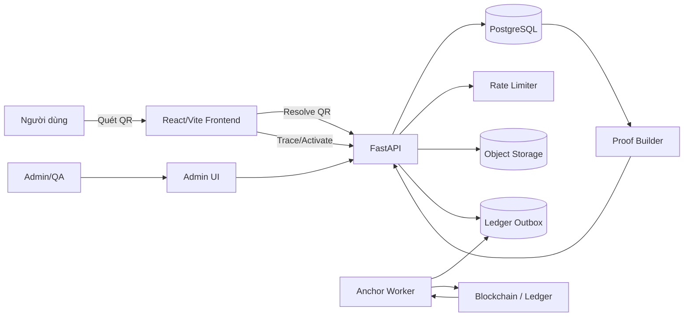
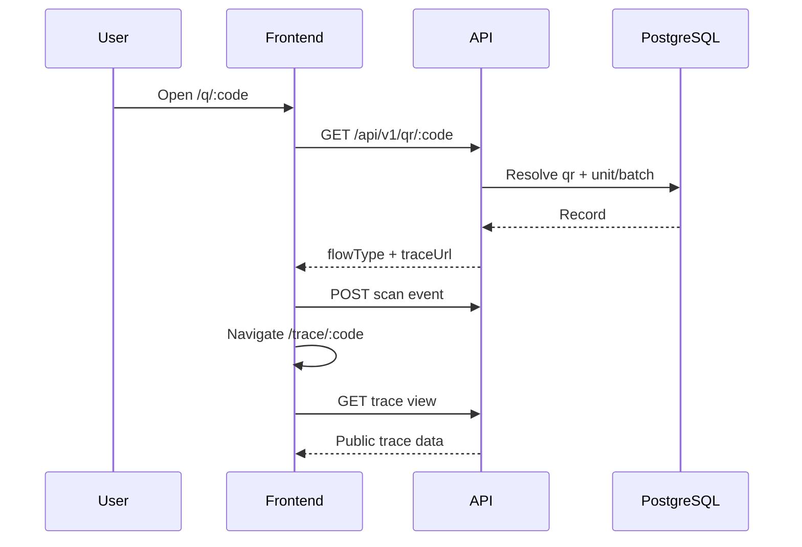
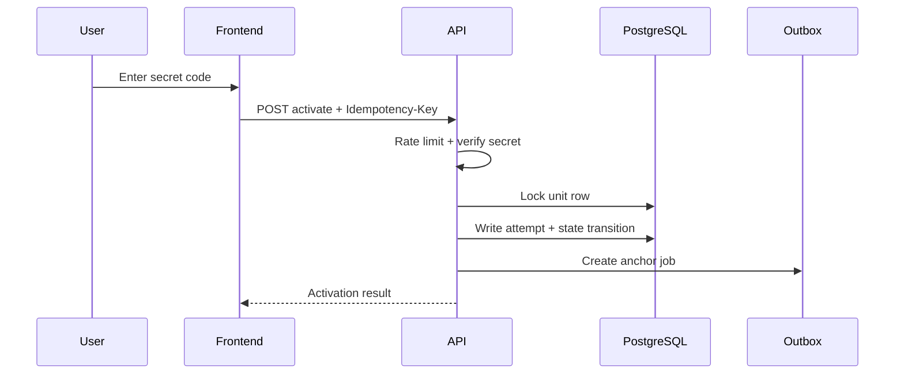
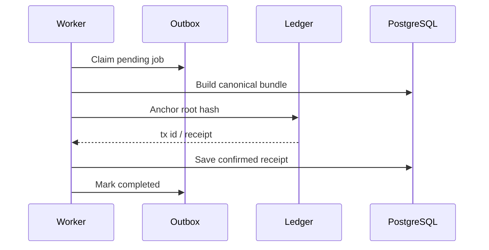

# 02. Kiến trúc mục tiêu

## 1. Sơ đồ tổng thể



## 2. Ranh giới trách nhiệm

### 2.1. Frontend

- Resolve QR.
- Hiển thị trạng thái.
- Hiển thị timeline và proof summary.
- Nhận secret code.
- Không tự chấm điểm rủi ro.
- Không tự kết luận hàng giả.
- Không giữ secret code sau request.
- Gửi analytics không chứa PII.

### 2.2. Backend

- Nguồn chuẩn cho trạng thái QR, batch, unit và activation.
- Xác minh secret code.
- Tạo risk signal.
- Quản lý state transition.
- Canonical hóa và hash dữ liệu.
- Ghi outbox và anchor.
- Phân quyền admin.
- Redact log.
- Trả proof đã kiểm chứng.

### 2.3. PostgreSQL

- Dữ liệu vận hành đầy đủ.
- State machine.
- Scan/activation audit.
- Hash và transaction receipt.
- Không lưu secret code plaintext.
- Không coi blockchain là nguồn query trực tiếp cho UI.

### 2.4. Blockchain

- Lưu hash hoặc root hash.
- Lưu revision và timestamp.
- Lưu transaction ID/contract event.
- Không lưu raw document.
- Không lưu IP, user-agent, email, số điện thoại.
- Không được gọi đồng bộ trong request activation.

## 3. Thành phần kiến trúc

### 3.1. QR Resolver

Input: `code`.

Output:

```json
{
  "code": "U7K9M4C8Q2",
  "flowType": "unit-trace",
  "status": "active",
  "traceUrl": "/trace/U7K9M4C8Q2",
  "productSlug": "petal-pack",
  "batchCode": "PP-20260720-B03"
}
```

Resolver kiểm tra theo thứ tự:

1. chuẩn hóa code;
2. tìm QR record;
3. kiểm tra QR status;
4. tìm unit/batch reference;
5. kiểm tra unit/batch status;
6. tạo internal route;
7. không nhận destination tuyệt đối từ client.

### 3.2. Trace Service

Trách nhiệm:

- build public trace view;
- lọc trường công khai;
- áp dụng trạng thái recall;
- tính timeline;
- trả blockchain proof status;
- tránh lộ internal IDs.

### 3.3. Activation Service

Trách nhiệm:

- xác minh secret;
- kiểm tra state;
- rate limit;
- chống replay/idempotency;
- ghi activation attempt;
- cập nhật activated state;
- tạo risk signal;
- tạo anchor candidate.

### 3.4. Risk Engine

Không dùng ML trong MVP. Dùng rule-based score:

```text
scan trước distributed              +50
secret sai nhiều lần                +20
nhiều thiết bị trong 10 phút        +25
địa lý bất khả thi                  +30
scan hàng loạt nhiều mã từ một IP   +40
scan lại cùng client token           +0
refresh trong cùng session           +0
```

Ngưỡng gợi ý:

- 0–29: normal;
- 30–59: recheck;
- 60–89: suspicious;
- 90+: compromised candidate, cần review.

Ngưỡng phải cấu hình bằng database hoặc environment, không hard-code trong frontend.

### 3.5. Hash/Proof Builder

Input:

- batch revision;
- trace events đã duyệt;
- document hashes;
- unit state summary.

Output:

```json
{
  "schemaVersion": "trace-bundle-v1",
  "entityType": "batch",
  "entityId": "PP-20260720-B03",
  "revision": 4,
  "rootHash": "sha256:...",
  "previousRootHash": "sha256:...",
  "generatedAt": "2026-07-20T10:00:00Z"
}
```

### 3.6. Ledger Adapter

Interface:

```python
class LedgerPort(Protocol):
    async def anchor(self, command: AnchorCommand) -> AnchorReceipt: ...
    async def get_receipt(self, external_id: str) -> AnchorReceipt | None: ...
    async def verify(self, proof: ProofQuery) -> VerificationResult: ...
```

Implementations:

- `DatabaseLedgerAdapter`: R1, phục vụ test.
- `EvmLedgerAdapter`: R3 testnet.
- `FabricLedgerAdapter`: R4 khi có partner node.

## 4. Luồng request chính

### 4.1. Quét QR



### 4.2. Kích hoạt



### 4.3. Neo blockchain



## 5. Yêu cầu phi chức năng

| Nhóm | Yêu cầu |
|---|---|
| Availability | Trace page vẫn hoạt động khi blockchain down |
| Performance | QR resolve p95 < 600 ms |
| Security | Secret không log; admin MFA ở production |
| Privacy | Chỉ vị trí cấp tỉnh/thành nếu có consent |
| Audit | Mutation admin có actor/action/request ID |
| Integrity | Correction tạo revision mới |
| Scalability | Scan event append-only, index theo code/time |
| Maintainability | Ledger qua port/adapter |
| Accessibility | Status không chỉ truyền đạt bằng màu |
| Localization | `vi` mặc định, schema hỗ trợ locale |

## 6. Điểm không được triển khai

- Frontend gọi trực tiếp smart contract.
- Private key trong Vercel.
- Gọi blockchain trong transaction kích hoạt.
- Lưu secret code plaintext.
- Dùng device fingerprint xâm lấn.
- Gắn nhãn “fake” tự động.
- Xóa event đã neo.
