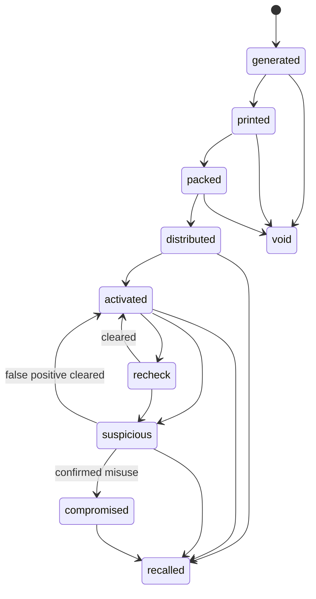

# 03. Domain model và state machine

## 1. Aggregate chính

### 1.1. TraceBatch

Đại diện một lô sản xuất hoặc đóng gói.

Thuộc tính chính:

- `batch_code`;
- `product_slug`;
- `content_version`;
- `status`;
- `production_date`;
- `packaged_at`;
- `best_before`;
- `source_summary`;
- `revision`;
- `public_visibility`;
- `created_by`;
- `approved_by`.

### 1.2. TraceUnit

Đại diện một pack hoặc hộp được serial hóa.

- `public_code`;
- `secret_digest`;
- `batch_id`;
- `status`;
- `printed_at`;
- `packed_at`;
- `distributed_at`;
- `activated_at`;
- `risk_level`;
- `scan_count`;
- `unique_client_count`;
- `version`.

### 1.3. TraceEvent

Sự kiện truy xuất append-only.

- `event_type`;
- `entity_type`;
- `entity_id`;
- `occurred_at`;
- `recorded_at`;
- `location_code`;
- `actor_org`;
- `payload_json`;
- `payload_hash`;
- `status`;
- `supersedes_event_id`.

### 1.4. TraceDocument

Metadata và hash của tài liệu.

- `document_type`;
- `storage_key`;
- `sha256`;
- `mime_type`;
- `size_bytes`;
- `issued_by`;
- `issued_at`;
- `visibility`.

### 1.5. ActivationAttempt

- unit;
- result;
- occurred_at;
- client_token_hash;
- ip_prefix_hash;
- user_agent_family;
- region_code;
- risk_delta;
- request_id.

### 1.6. LedgerAnchor

- entity type/id;
- revision;
- root hash;
- network;
- contract;
- transaction id;
- status;
- submitted/confirmed time;
- error code;
- retry count.

## 2. Batch state machine

```mermaid
stateDiagram-v2
    [*] --> draft
    draft --> processing: start
    processing --> qa_pending: submit QA
    qa_pending --> approved: QA approve
    qa_pending --> processing: QA return
    approved --> distributed: first shipment
    distributed --> recalled: recall
    approved --> recalled: recall before sale
    recalled --> closed: complete recall
    distributed --> closed: end lifecycle
    draft --> void: cancel
    processing --> void: cancel with reason
```

Quy tắc:

- `approved` yêu cầu đầy đủ trường bắt buộc.
- `distributed` yêu cầu ít nhất một shipment event.
- batch `recalled` ép toàn bộ unit chưa `void` sang trạng thái public recall.
- không xóa batch đã có unit.
- sửa dữ liệu đã approved tạo revision/correction.

## 3. Unit state machine

Quy tắc:

- `activated` chỉ từ `distributed`.
- activation trước distributed trả cảnh báo và ghi attempt, không chuyển state.
- `void` là terminal.
- `recalled` có ưu tiên hiển thị cao hơn `activated`.
- `compromised` không tự động đồng nghĩa sản phẩm vật lý là giả; nghĩa là mã xác thực đã bị lạm dụng hoặc sao chép được xác nhận.

## 4. QR state và unit state

QR record có state riêng:

- `active`;
- `paused`;
- `expired`;
- `revoked`.

Thứ tự ưu tiên khi resolve:

1. QR không tồn tại → `unknown`.
2. QR `revoked` → dừng.
3. QR `paused` hoặc `expired` → dừng.
4. Unit `void` → dừng.
5. Batch/unit `recalled` → hiển thị recall.
6. Unit hợp lệ → trace flow.

## 5. Public verification status

Backend map state nội bộ sang trạng thái công khai:

| Internal | Public status | Copy định hướng |
|---|---|---|
| generated/printed/packed | not-distributed | Mã chưa được phát hành để bán |
| distributed | valid-unactivated | Mã hợp lệ, chưa kích hoạt |
| activated | activated | Mã đã kích hoạt |
| recheck | recheck | Cần kiểm tra thêm |
| suspicious | suspicious | Mã có dấu hiệu được sử dụng bất thường |
| compromised | compromised | Mã xác thực đã bị lạm dụng |
| recalled | recalled | Sản phẩm thuộc diện thu hồi |
| void | invalid | Mã đã hủy |

Không trả public copy “hàng giả” từ state machine.

## 6. Event taxonomy

### 6.1. Nguyên liệu

- `raw_material_lot_created`
- `lotus_received`
- `tea_received`
- `lotus_preprocessed`
- `material_rejected`

### 6.2. Sản xuất

- `blend_started`
- `blend_completed`
- `bud_formed`
- `drying_started`
- `drying_completed`
- `filter_thread_attached`
- `batch_packaged`

### 6.3. Chất lượng

- `qa_sample_collected`
- `qa_result_attached`
- `qa_approved`
- `qa_rejected`
- `shelf_life_reviewed`

### 6.4. Phân phối

- `shipment_created`
- `shipment_dispatched`
- `shipment_received`
- `unit_distributed`

### 6.5. Quản trị

- `event_corrected`
- `batch_recalled`
- `unit_voided`
- `risk_reviewed`
- `anchor_requested`
- `anchor_confirmed`

## 7. Invariant bắt buộc

1. `public_code` unique, case-insensitive.
2. `secret_digest` unique.
3. Unit bắt buộc thuộc một batch.
4. Unit product phải khớp batch product.
5. Không activation unit void/recalled.
6. Event approved không sửa in-place.
7. Document hash không đổi; thay file tạo document mới.
8. Anchor revision không được giảm.
9. Mỗi entity/revision chỉ có một anchor logic thành công trên một network.
10. Recall reason bắt buộc.
11. Correction phải tham chiếu event trước.
12. Không trả `secret_digest` qua bất kỳ API.

## 8. Concurrency

- Activation dùng row lock hoặc optimistic version.
- Hai request activation đồng thời chỉ một request chuyển state.
- Request thứ hai nhận kết quả `ALREADY_ACTIVATED`, không tạo activation mới.
- Issue unit hàng loạt dùng transaction và unique constraint.
- Outbox job dùng `FOR UPDATE SKIP LOCKED`.
