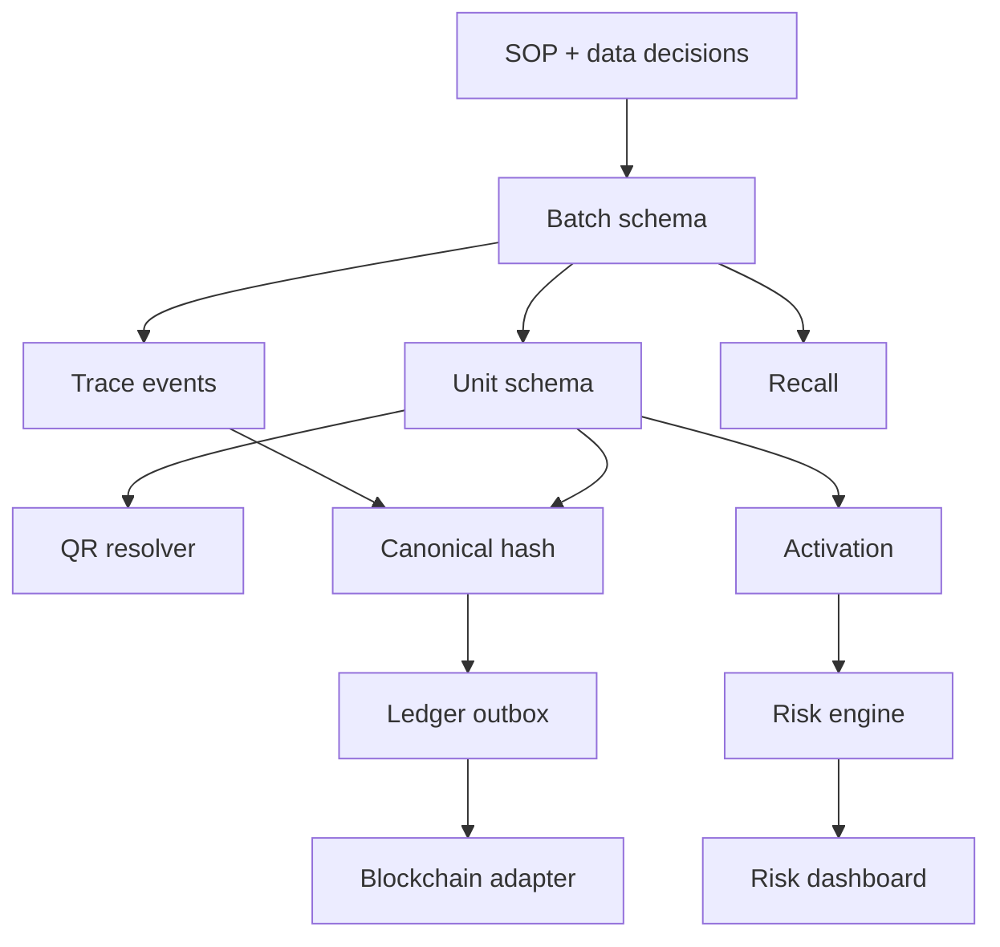

# 13. Roadmap và backlog triển khai

## 1. Roadmap 6 sprint

### Sprint 0 — Decision và SOP

- chốt domain QR;
- chốt unit pilot;
- chốt tem;
- chốt data fields;
- chốt role;
- chốt retention;
- tạo test fixture;
- viết SOP in/gắn tem.

### Sprint 1 — Batch trace foundation

- migration batch/event/document;
- admin batch API;
- public batch API;
- timeline frontend;
- audit;
- test.

### Sprint 2 — Unit identity

- migration unit;
- code generator;
- issue/export;
- mở rộng QR resolver;
- route trace;
- checkpoint workflow.

### Sprint 3 — Activation và risk

- activation API;
- client token;
- rate limit;
- risk rules;
- status UI;
- support flow;
- concurrency tests.

### Sprint 4 — Operations hardening

- admin risk queue;
- recall;
- correction;
- bulk transition;
- metrics;
- Redis;
- pilot.

### Sprint 5 — Ledger anchoring

- canonical hash;
- database adapter;
- outbox;
- worker;
- proof endpoint;
- EVM/Fabric adapter thử nghiệm;
- reconciliation.

## 2. Backlog

### EPIC TRACE-100 — Batch provenance

| ID | Task | Priority |
|---|---|---|
| TRACE-101 | Create batch schema/migration | P0 |
| TRACE-102 | Trace event schema | P0 |
| TRACE-103 | Document hash schema | P0 |
| TRACE-104 | Admin batch CRUD | P0 |
| TRACE-105 | QA approval | P0 |
| TRACE-106 | Public batch view | P0 |
| TRACE-107 | Timeline frontend | P0 |
| TRACE-108 | Correction event | P1 |

### EPIC TRACE-200 — Unit serial

| ID | Task | Priority |
|---|---|---|
| TRACE-201 | Unit schema | P0 |
| TRACE-202 | Random code generator | P0 |
| TRACE-203 | Secret digest | P0 |
| TRACE-204 | Unit issue job | P0 |
| TRACE-205 | Secure export | P0 |
| TRACE-206 | Printed/packed/distributed transitions | P0 |
| TRACE-207 | QR resolver flowType | P0 |
| TRACE-208 | Trace page | P0 |
| TRACE-209 | Void/reconcile | P0 |

### EPIC TRACE-300 — Activation

| ID | Task | Priority |
|---|---|---|
| TRACE-301 | Activation endpoint | P0 |
| TRACE-302 | Idempotency | P0 |
| TRACE-303 | Row lock/concurrency | P0 |
| TRACE-304 | Rate limit | P0 |
| TRACE-305 | Client token | P0 |
| TRACE-306 | Activation UI | P0 |
| TRACE-307 | Status copy | P0 |
| TRACE-308 | Scan event normalization | P1 |

### EPIC TRACE-400 — Risk

| ID | Task | Priority |
|---|---|---|
| TRACE-401 | Rule engine | P0 |
| TRACE-402 | Risk score persistence | P0 |
| TRACE-403 | Review queue | P1 |
| TRACE-404 | Clear/confirm workflow | P1 |
| TRACE-405 | Alerts | P1 |
| TRACE-406 | Aggregate anomaly report | P2 |

### EPIC TRACE-500 — Recall/support

| ID | Task | Priority |
|---|---|---|
| TRACE-501 | Batch recall | P0 |
| TRACE-502 | Unit recall | P1 |
| TRACE-503 | Recall UI | P0 |
| TRACE-504 | Support route/form | P1 |
| TRACE-505 | Support admin context | P1 |
| TRACE-506 | Incident runbook | P0 |

### EPIC TRACE-600 — Ledger

| ID | Task | Priority |
|---|---|---|
| TRACE-601 | Canonical bundle | P0 R3 |
| TRACE-602 | Hash test vectors | P0 R3 |
| TRACE-603 | Ledger port | P0 R3 |
| TRACE-604 | Database adapter | P0 R3 |
| TRACE-605 | Outbox | P0 R3 |
| TRACE-606 | Worker | P0 R3 |
| TRACE-607 | Proof endpoint | P0 R3 |
| TRACE-608 | EVM testnet adapter | P1 |
| TRACE-609 | Reconciliation | P0 R3 |
| TRACE-610 | Fabric adapter | P2 |

## 3. Dependency graph

## 4. Team split gợi ý

### Backend

- migration/domain;
- public API;
- admin API;
- risk;
- ledger.

### Frontend

- QR resolve;
- trace page;
- activation;
- statuses;
- admin pages.

### Product/Operations

- data fields;
- SOP;
- print template;
- public copy;
- recall/support.

### QA

- test cases;
- physical QR;
- security;
- pilot data.

## 5. Decision gates

### Gate A — Before unit serial

- pack vật lý có vị trí secret;
- code printing feasible;
- mapping SOP approved.

### Gate B — Before public activation

- race test pass;
- rate limit;
- privacy copy;
- support process;
- no secret logs.

### Gate C — Before blockchain claim

- root hash deterministic;
- outbox/reconciliation pass;
- transaction visible;
- proof mismatch detected;
- communication approved.

## 6. Definition of Done

Mỗi task:

- code;
- tests;
- migration nếu có;
- docs;
- audit/security review;
- API contract;
- analytics check;
- staging verification;
- rollback/feature flag;
- acceptance sign-off.

## 7. Ước lượng tương đối

| Epic | Size |
|---|---|
| Batch provenance | L |
| Unit serial | L |
| Activation | M |
| Risk | M |
| Recall/support | M |
| Ledger database adapter | M |
| EVM testnet | M |
| Permissioned network | XL |

Permissioned network không nằm trong MVP sinh viên.
